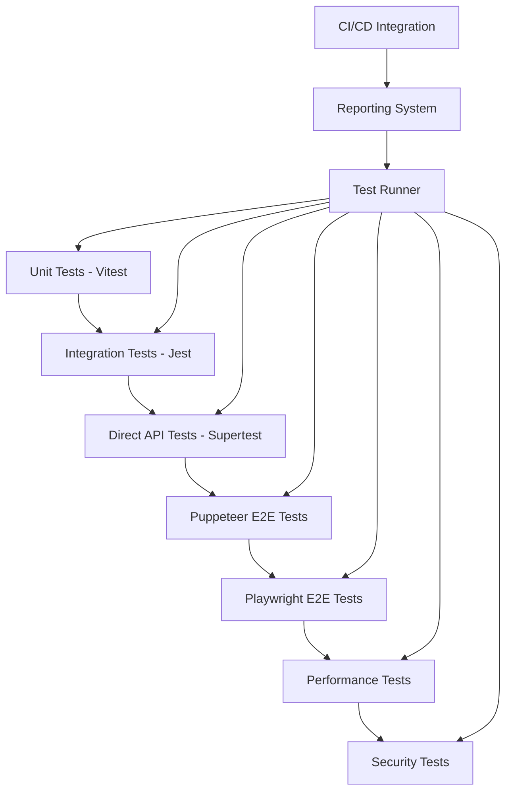

# Design Document

## Overview

The comprehensive testing system for LogistiX provides complete coverage of all features through a strategic multi-layered testing approach. The system implements three complementary testing methodologies: Direct API testing with Supertest for endpoint validation, Classic Backend testing with Jest for business logic verification, and Puppeteer UI testing for complete user workflow automation. This design ensures immediate detection of API failures, data integrity issues, UI workflow problems, and enables proactive bug prevention through advanced error detection and automated reporting capabilities.

## Architecture

### Testing Layers



### Test Framework Stack

- **Unit Testing**: Vitest for component and service testing
- **Direct API Testing**: Supertest + Jest for direct backend endpoint calls
- **Classic Integration Testing**: Jest for service-to-service integration
- **Puppeteer E2E Testing**: Puppeteer for comprehensive UI automation and user workflows
- **Playwright E2E Testing**: Playwright for cross-browser compatibility testing
- **Performance Testing**: Custom performance monitoring with metrics collection
- **Security Testing**: Custom security validation suite with penetration testing
- **Load Testing**: Artillery.js for stress testing and concurrent user simulation

### Multi-Layer Testing Approach

#### Layer 1: Direct API Testing

- **Method**: Direct HTTP calls using Supertest
- **Purpose**: Test API endpoints in isolation
- **Coverage**: All REST endpoints, authentication, data validation
- **Tools**: Supertest, Jest, custom API client

#### Layer 2: Classic Backend Testing

- **Method**: Direct function/service calls
- **Purpose**: Test business logic without HTTP overhead
- **Coverage**: Service classes, database operations, calculations
- **Tools**: Jest, Vitest, database mocking

#### Layer 3: Puppeteer UI Testing

- **Method**: Browser automation with Puppeteer
- **Purpose**: Complete user workflow testing
- **Coverage**: All UI interactions, form submissions, navigation
- **Tools**: Puppeteer, Jest, custom page objects

#### Layer 4: Cross-Browser Testing

- **Method**: Multi-browser automation with Playwright
- **Purpose**: Ensure compatibility across browsers
- **Coverage**: Critical user paths on Chrome, Firefox, Safari
- **Tools**: Playwright, custom browser configurations

## Components and Interfaces

### 1. Test Configuration Manager

```typescript
interface TestConfig {
  environment: 'development' | 'staging' | 'production';
  baseUrl: string;
  apiVersion: string;
  testData: TestDataConfig;
  timeouts: TimeoutConfig;
  browsers: BrowserConfig[];
  parallel: boolean;
  retries: number;
}

interface TestDataConfig {
  users: UserTestData[];
  parcelles: ParcelleTestData[];
  products: ProductTestData[];
  vintedCredentials: VintedTestCredentials;
}
```

### 2. API Test Framework

```typescript
interface ApiTestSuite {
  name: string;
  baseUrl: string;
  endpoints: ApiEndpoint[];
  authentication: AuthConfig;
  dataValidation: ValidationSchema[];
}

interface ApiEndpoint {
  path: string;
  method: HttpMethod;
  expectedStatus: number[];
  requestSchema?: Schema;
  responseSchema?: Schema;
  testCases: ApiTestCase[];
}

interface ApiTestCase {
  name: string;
  description: string;
  setup?: () => Promise<void>;
  teardown?: () => Promise<void>;
  request: RequestData;
  expectedResponse: ExpectedResponse;
  assertions: Assertion[];
}
```

### 3. UI Test Framework

```typescript
interface UiTestSuite {
  name: string;
  pages: PageObject[];
  workflows: UserWorkflow[];
  accessibility: AccessibilityTests;
  responsive: ResponsiveTests;
}

interface PageObject {
  name: string;
  url: string;
  selectors: ElementSelectors;
  actions: PageAction[];
  validations: PageValidation[];
}

interface UserWorkflow {
  name: string;
  description: string;
  steps: WorkflowStep[];
  expectedOutcome: string;
  rollback?: WorkflowStep[];
}
```

### 4. Performance Test Framework

```typescript
interface PerformanceTestSuite {
  name: string;
  scenarios: LoadScenario[];
  metrics: PerformanceMetric[];
  thresholds: PerformanceThreshold[];
}

interface LoadScenario {
  name: string;
  virtualUsers: number;
  duration: string;
  rampUp: string;
  endpoints: EndpointLoad[];
}

interface PerformanceMetric {
  name: string;
  type: 'response_time' | 'throughput' | 'error_rate' | 'resource_usage';
  threshold: number;
  unit: string;
}
```

### 5. Test Reporting System

```typescript
interface TestReport {
  id: string;
  timestamp: Date;
  environment: string;
  summary: TestSummary;
  suites: TestSuiteResult[];
  coverage: CoverageReport;
  performance: PerformanceReport;
  screenshots: Screenshot[];
  logs: TestLog[];
}

interface TestSummary {
  total: number;
  passed: number;
  failed: number;
  skipped: number;
  duration: number;
  coverage: number;
}
```

## Data Models

### Test Data Management

```typescript
// Test User Data
interface TestUser {
  id: string;
  username: string;
  email: string;
  password: string;
  role: 'admin' | 'user';
  profile: UserProfile;
  permissions: Permission[];
}

// Test Parcelle Data
interface TestParcelle {
  id: string;
  numero: string;
  transporteur: string;
  poids: number;
  prixAchat: number;
  dateCreation: Date;
  products: TestProduct[];
}

// Test Product Data
interface TestProduct {
  id: string;
  nom: string;
  prix: number;
  quantite: number;
  parcelleId: string;
  description?: string;
  status: 'available' | 'sold';
  dateVente?: Date;
}

// Vinted Test Data
interface VintedTestData {
  credentials: VintedCredentials;
  searchQueries: SearchQuery[];
  expectedResults: MarketAnalysisResult[];
  mockResponses: VintedApiResponse[];
}
```

### Error Tracking Models

```typescript
interface TestError {
  id: string;
  timestamp: Date;
  testSuite: string;
  testCase: string;
  errorType: ErrorType;
  message: string;
  stackTrace: string;
  screenshot?: string;
  context: ErrorContext;
  severity: 'low' | 'medium' | 'high' | 'critical';
}

interface ErrorContext {
  url: string;
  userAgent: string;
  viewport: Viewport;
  networkLogs: NetworkLog[];
  consoleLogs: ConsoleLog[];
  domSnapshot?: string;
}
```

## Error Handling

### Test Failure Recovery

```typescript
class TestFailureHandler {
  async handleFailure(error: TestError): Promise<void> {
    // Capture detailed error context
    await this.captureErrorContext(error);
    
    // Attempt automatic recovery
    const recovered = await this.attemptRecovery(error);
    
    if (!recovered) {
      // Log detailed failure information
      await this.logFailure(error);
      
      // Send notifications if critical
      if (error.severity === 'critical') {
        await this.sendAlert(error);
      }
    }
  }

  private async captureErrorContext(error: TestError): Promise<void> {
    // Capture screenshots, DOM state, network logs, etc.
  }

  private async attemptRecovery(error: TestError): Promise<boolean> {
    // Implement retry logic with exponential backoff
    // Reset application state if needed
    // Clear cache/cookies if authentication issues
  }
}
```

### API Error Simulation

```typescript
class ApiErrorSimulator {
  async simulateNetworkFailure(endpoint: string): Promise<void> {
    // Simulate network timeouts, connection errors
  }

  async simulateServerErrors(endpoint: string): Promise<void> {
    // Simulate 500, 503, 502 errors
  }

  async simulateRateLimiting(endpoint: string): Promise<void> {
    // Simulate 429 Too Many Requests
  }

  async simulateAuthenticationFailure(): Promise<void> {
    // Simulate expired tokens, invalid credentials
  }
}
```

### Proactive Bug Detection System

```typescript
class ProactiveBugDetector {
  async detectRaceConditions(): Promise<RaceConditionReport[]> {
    // Analyze concurrent operations for potential race conditions
    // Monitor database transactions and resource access patterns
    // Identify potential deadlock scenarios
  }

  async detectMemoryLeaks(): Promise<MemoryLeakReport[]> {
    // Monitor memory usage patterns during test execution
    // Identify objects that aren't being garbage collected
    // Track memory growth over time
  }

  async detectPerformanceDegradation(): Promise<PerformanceIssue[]> {
    // Compare current performance metrics with baselines
    // Identify slow queries and bottlenecks
    // Monitor resource utilization trends
  }

  async detectSecurityVulnerabilities(): Promise<SecurityIssue[]> {
    // Test for SQL injection vulnerabilities
    // Validate authentication bypass attempts
    // Check for XSS and CSRF vulnerabilities
    // Verify input sanitization effectiveness
  }

  async detectDataIntegrityIssues(): Promise<DataIntegrityIssue[]> {
    // Validate referential integrity constraints
    // Check for orphaned records
    // Verify data consistency across tables
    // Identify boundary condition failures
  }
}
```

### Automated CI/CD Integration

```typescript
interface CICDIntegration {
  triggerConditions: TriggerCondition[];
  testSuiteSelection: TestSuiteSelector;
  parallelExecution: ParallelConfig;
  reportingConfig: ReportingConfig;
  notificationConfig: NotificationConfig;
}

interface TriggerCondition {
  event: 'push' | 'pull_request' | 'schedule' | 'manual';
  branches: string[];
  paths: string[];
  testSuites: string[];
}

class AutomatedTestRunner {
  async executeOnCodeChange(changes: CodeChange[]): Promise<TestResults> {
    // Analyze code changes to determine relevant test suites
    // Execute tests in parallel based on dependency graph
    // Generate comprehensive reports with coverage metrics
  }

  async sendNotifications(results: TestResults): Promise<void> {
    // Send immediate alerts for critical failures
    // Generate summary reports for stakeholders
    // Update dashboard with real-time status
  }
}
```

## Testing Strategy

### Multi-Layer Testing Methodology

Each feature will be tested using three complementary approaches:

1. **Direct API Testing (Supertest)**: Direct HTTP calls to test API endpoints in isolation
2. **Classic Backend Testing (Jest)**: Direct function calls to test business logic without HTTP overhead
3. **Puppeteer UI Testing**: Complete browser automation to test user workflows end-to-end

This approach ensures comprehensive coverage from the lowest level (individual functions) to the highest level (complete user interactions).

### 1. Authentication & User Management Tests

#### Direct API Tests (Supertest)

```typescript
describe('Authentication API - Direct HTTP Calls', () => {
  // Direct endpoint testing with supertest
  test('POST /api/v1/auth/login - valid credentials via HTTP');
  test('POST /api/v1/auth/login - invalid credentials via HTTP');
  test('POST /api/v1/auth/login - missing fields via HTTP');
  test('POST /api/v1/auth/login - SQL injection attempts via HTTP');
  test('POST /api/v1/auth/login - rate limiting via HTTP');
  
  // Session management via HTTP
  test('Session creation and validation via HTTP');
  test('Session expiration handling via HTTP');
  test('Concurrent session limits via HTTP');
  test('Session hijacking prevention via HTTP');
  
  // Profile management via HTTP
  test('GET /api/v1/auth/profile - authenticated user via HTTP');
  test('PUT /api/v1/auth/profile - update profile via HTTP');
  test('PUT /api/v1/auth/profile - invalid data via HTTP');
  test('DELETE /api/v1/auth/profile - account deletion via HTTP');
});
```

#### Classic Backend Tests (Jest)

```typescript
describe('Authentication Services - Direct Function Calls', () => {
  // Direct service method testing
  test('AuthService.validateCredentials() - password validation');
  test('AuthService.hashPassword() - bcrypt implementation');
  test('SessionService.createSession() - session generation');
  test('SessionService.validateSession() - session validation');
  test('ProfileService.updateProfile() - profile updates');
  test('AuditService.logUserAction() - audit logging');
  test('DatabaseService.getUserByEmail() - user retrieval');
  test('ValidationService.validateUserInput() - input sanitization');
});
```

#### Puppeteer UI Tests

```typescript
describe('Authentication UI - Puppeteer Browser Automation', () => {
  // Complete user workflow testing with Puppeteer
  test('Complete login workflow with valid credentials');
  test('Complete login workflow with invalid credentials');
  test('Complete registration workflow with form validation');
  test('Complete password reset workflow');
  test('Complete profile update workflow with avatar upload');
  test('Complete theme switching workflow');
  test('Complete session timeout and re-authentication workflow');
  test('Complete multi-tab session management workflow');
});
```

### 2. Parcel Management Tests

#### Backend API Tests

```typescript
describe('Parcelles API', () => {
  // CRUD operations
  test('GET /api/v1/parcelles - list parcelles');
  test('POST /api/v1/parcelles - create parcelle');
  test('PUT /api/v1/parcelles/:id - update parcelle');
  test('DELETE /api/v1/parcelles/:id - delete parcelle');
  
  // Business logic tests
  test('Price per gram calculation');
  test('Product association validation');
  test('Duplicate numero prevention');
  test('Data integrity constraints');
  
  // Performance tests
  test('Large dataset handling');
  test('Concurrent modifications');
  test('Database transaction integrity');
});
```

#### Frontend UI Tests

```typescript
describe('Parcelles UI', () => {
  // List view tests
  test('Display parcelles list');
  test('Sort parcelles by different fields');
  test('Filter parcelles by criteria');
  test('Search parcelles');
  test('Pagination functionality');
  
  // Form tests
  test('Create new parcelle');
  test('Edit existing parcelle');
  test('Form validation');
  test('Auto-calculation features');
  
  // Interaction tests
  test('Delete parcelle with confirmation');
  test('Bulk operations');
  test('Export parcelles data');
});
```

### 3. Product Management Tests

#### Backend API Tests for product Management Tests

```typescript
describe('Products API', () => {
  // CRUD operations
  test('GET /api/v1/produits - list products');
  test('POST /api/v1/produits - create product');
  test('PUT /api/v1/produits/:id - update product');
  test('DELETE /api/v1/produits/:id - delete product');
  
  // Sales tracking tests
  test('POST /api/v1/produits/:id/vente - record sale');
  test('Sales calculation accuracy');
  test('Profit margin calculations');
  test('ROI calculations');
  
  // Data validation tests
  test('Price validation');
  test('Quantity validation');
  test('Parcelle association validation');
  test('Status transition validation');
});
```

#### Frontend UI Tests for product Management Tests

```typescript
describe('Products UI', () => {
  // Product management
  test('Create product with all fields');
  test('Edit product information');
  test('Delete product with confirmation');
  test('Bulk product operations');
  
  // Sales workflow
  test('Record product sale');
  test('Update sale information');
  test('View sales history');
  test('Calculate profit margins');
  
  // Data visualization
  test('Product statistics display');
  test('Charts and graphs rendering');
  test('Export functionality');
});
```

### 4. Market Analysis Tests

#### Backend API Tests for market Analysis Tests

```typescript
describe('Market Analysis API', () => {
  // Vinted integration tests
  test('GET /api/v1/market-analysis/search - Vinted search');
  test('Vinted authentication handling');
  test('API rate limiting compliance');
  test('Error handling for external API failures');
  
  // Data processing tests
  test('Search query parsing');
  test('Results aggregation');
  test('Price analysis calculations');
  test('Historical data storage');
  
  // Performance tests
  test('Large dataset processing');
  test('Concurrent analysis requests');
  test('Cache effectiveness');
});
```

#### Frontend UI Tests for market Analysis Tests

```typescript
describe('Market Analysis UI', () => {
  // Search functionality
  test('Perform market analysis search');
  test('Display search results');
  test('Filter and sort results');
  test('Save search queries');
  
  // Data visualization
  test('Price distribution charts');
  test('Market trend graphs');
  test('Comparison tables');
  test('Export analysis results');
  
  // Interactive features
  test('Drill-down functionality');
  test('Real-time updates');
  test('Bookmark favorite analyses');
});
```

### 5. Dashboard & Statistics Tests

#### Backend API Tests for dashboard & Statistics Tests

```typescript
describe('Dashboard API', () => {
  // Statistics calculations
  test('GET /api/v1/statistiques/roi - ROI calculations');
  test('GET /api/v1/statistiques/sales - sales metrics');
  test('GET /api/v1/statistiques/performance - performance data');
  
  // Data aggregation tests
  test('Multi-dimensional data aggregation');
  test('Time-based filtering');
  test('Cross-table calculations');
  test('Real-time data updates');
});
```

#### Frontend UI Tests

```typescript
describe('Dashboard UI', () => {
  // Widget functionality
  test('Display dashboard widgets');
  test('Customize widget layout');
  test('Widget data refresh');
  test('Interactive chart elements');
  
  // Responsive design
  test('Mobile dashboard layout');
  test('Tablet optimization');
  test('Desktop full features');
  
  // Performance
  test('Dashboard load times');
  test('Chart rendering performance');
  test('Data update responsiveness');
});
```

### 6. Integration Tests

#### End-to-End Workflows

```typescript
describe('Complete User Workflows', () => {
  test('New user registration to first sale');
  test('Parcel creation to product sale workflow');
  test('Market analysis to pricing decision');
  test('Data import to dashboard visualization');
  test('Multi-user collaboration scenarios');
});
```

#### External Service Integration

```typescript
describe('External Integrations', () => {
  test('Vinted API integration reliability');
  test('Database backup and restore');
  test('Email notification delivery');
  test('File upload and processing');
  test('Export format compatibility');
});
```

### 7. Performance & Load Tests

#### Load Testing Scenarios

```typescript
describe('Performance Tests', () => {
  test('Concurrent user load (100 users)');
  test('Database query performance');
  test('API response times under load');
  test('Memory usage monitoring');
  test('CPU utilization tracking');
  
  test('Large dataset handling');
  test('File upload performance');
  test('Export generation speed');
  test('Search performance with large datasets');
});
```

### 8. Import/Export Data Tests

#### Backend API Tests

```typescript
describe('Import/Export API', () => {
  // Export functionality tests
  test('GET /api/v1/export/complete - full data export');
  test('GET /api/v1/export/selective - filtered export');
  test('Export format validation (JSON, CSV, PDF)');
  test('Export compression and metadata');
  test('Large dataset export performance');
  
  // Import functionality tests
  test('POST /api/v1/import/data - data import');
  test('Import format validation');
  test('Data integrity verification');
  test('Conflict resolution during import');
  test('Import rollback capabilities');
});
```

#### Frontend UI Tests

```typescript
describe('Import/Export UI', () => {
  // Export tests
  test('Export complete data with metadata');
  test('Selective export by data type');
  test('Export progress indication');
  test('Download file generation');
  
  // Import tests
  test('File upload and validation');
  test('Import preview and confirmation');
  test('Error handling during import');
  test('Import progress tracking');
  test('Data merge conflict resolution');
});
```

### 9. Administration & Maintenance Tests

#### Backend API Tests

```typescript
describe('Administration API', () => {
  // Data explorer tests
  test('GET /api/v1/admin/database/overview - DB overview');
  test('GET /api/v1/admin/database/tables - table inspection');
  test('POST /api/v1/admin/database/query - custom queries');
  test('Database maintenance operations');
  
  // System monitoring tests
  test('GET /api/v1/admin/system/health - system health');
  test('GET /api/v1/admin/system/metrics - performance metrics');
  test('GET /api/v1/admin/system/logs - system logs');
  test('Resource utilization monitoring');
  
  // Migration and backup tests
  test('Database migration execution');
  test('Automated backup creation');
  test('Backup integrity verification');
  test('Data restoration procedures');
});
```

#### Frontend UI Tests

```typescript
describe('Administration UI', () => {
  // Data explorer tests
  test('Database overview dashboard');
  test('Table inspection interface');
  test('Custom query execution');
  test('Data maintenance tools');
  
  // System monitoring tests
  test('System health dashboard');
  test('Performance metrics visualization');
  test('Log viewer and filtering');
  test('Resource usage charts');
  
  // Maintenance operations
  test('Migration status tracking');
  test('Backup management interface');
  test('System maintenance tools');
});
```

### 10. Search & Navigation Tests

#### Backend API Tests

```typescript
describe('Search API', () => {
  // Global search tests
  test('GET /api/v1/search/global - global search');
  test('Search across multiple data types');
  test('Search result ranking and relevance');
  test('Search performance with large datasets');
  test('Search history management');
  
  // Auto-suggestions tests
  test('GET /api/v1/search/suggestions - search suggestions');
  test('Real-time suggestion generation');
  test('Suggestion accuracy and relevance');
  test('Suggestion caching and performance');
});
```

#### Frontend UI Tests

```typescript
describe('Search & Navigation UI', () => {
  // Global search tests
  test('Global search functionality');
  test('Search suggestions and autocomplete');
  test('Search result display and filtering');
  test('Search history and saved searches');
  
  // Navigation tests
  test('Sidebar navigation responsiveness');
  test('Breadcrumb navigation accuracy');
  test('Keyboard shortcuts functionality');
  test('Contextual navigation elements');
  test('Mobile navigation menu');
});
```

### 11. User Interface Tests

#### Frontend UI Tests

```typescript
describe('UI Framework Tests', () => {
  // Design system tests
  test('Tailwind CSS styling consistency');
  test('shadcn/ui component functionality');
  test('Design token application');
  test('Responsive design breakpoints');
  
  // Animation and interaction tests
  test('Framer Motion animations');
  test('Smooth transitions between states');
  test('Micro-interactions responsiveness');
  test('Loading state animations');
  
  // Theme system tests
  test('Light/dark theme switching');
  test('System theme detection');
  test('Theme preference persistence');
  test('Color customization features');
  
  // Component library tests
  test('Reusable component functionality');
  test('Component accessibility compliance');
  test('Component prop validation');
  test('Component error boundaries');
});
```

### 12. Technical Features Tests

#### Backend API Tests

```typescript
describe('Technical Infrastructure API', () => {
  // API architecture tests
  test('API versioning compliance (/api/v1/)');
  test('Zod schema validation');
  test('Centralized error handling');
  test('API documentation generation');
  
  // Database tests
  test('SQLite connection management');
  test('Migration execution and rollback');
  test('Connection pooling efficiency');
  test('ACID transaction compliance');
  
  // Logging and monitoring tests
  test('Winston logging configuration');
  test('Log rotation functionality');
  test('Audit log generation');
  test('Performance instrumentation');
  test('Alert system functionality');
});
```

### 13. System Features Tests

#### Backend System Tests

```typescript
describe('System Features', () => {
  // Performance monitoring tests
  test('Request instrumentation accuracy');
  test('Query performance monitoring');
  test('Resource utilization tracking');
  test('Automated alert generation');
  
  // Health check tests
  test('System health endpoint');
  test('Database connectivity checks');
  test('External service availability');
  test('Performance threshold monitoring');
  
  // Scalability tests
  test('Concurrent request handling');
  test('Database connection scaling');
  test('Memory usage optimization');
  test('CPU utilization efficiency');
});
```

### 14. Security & Validation Tests

#### Security Tests

```typescript
describe('Security & Validation', () => {
  // Application security tests
  test('Password hashing with bcrypt');
  test('Secure session management');
  test('CSRF protection validation');
  test('Input validation and sanitization');
  
  // Audit and traceability tests
  test('Complete audit log generation');
  test('User action traceability');
  test('Anomaly detection algorithms');
  test('Security report generation');
  
  // Validation system tests
  test('Manual validation checklists');
  test('Automated integration testing');
  test('External API validation');
  test('System health monitoring');
  
  // Security vulnerability tests
  test('SQL injection prevention');
  test('XSS attack prevention');
  test('Authentication bypass attempts');
  test('Authorization boundary testing');
  test('File upload security');
  test('API rate limiting');
  test('Data encryption validation');
});
```

### 15. External Integrations Tests

#### Backend API Tests

```typescript
describe('External Integrations API', () => {
  // Vinted API integration tests
  test('Vinted authentication flow');
  test('Product metadata synchronization');
  test('Category hierarchy sync');
  test('Brand information retrieval');
  test('Market data collection');
  
  // Token management tests
  test('Vinted token management');
  test('Automatic token renewal');
  test('Credential validation');
  test('API error handling');
  
  // Data parsing tests
  test('Semantic query analysis');
  test('Entity extraction accuracy');
  test('Automatic suggestions generation');
  test('Error correction algorithms');
});
```

#### Frontend UI Tests

```typescript
describe('External Integrations UI', () => {
  // Vinted integration tests
  test('Vinted authentication setup');
  test('Market analysis interface');
  test('Product comparison displays');
  test('Integration status indicators');
  
  // Data parsing interface tests
  test('Query input and parsing');
  test('Suggestion display and selection');
  test('Error correction interface');
  test('Integration health monitoring');
});
```

### 16. Metrics & KPIs Tests

#### Backend API Tests

```typescript
describe('Metrics & KPIs API', () => {
  // Business metrics tests
  test('Revenue calculation accuracy');
  test('Profit margin calculations');
  test('Stock rotation rate calculations');
  test('ROI per product/parcel calculations');
  
  // Technical metrics tests
  test('API response time measurement');
  test('Resource utilization tracking');
  test('Error rate calculations');
  test('System availability monitoring');
  
  // Automated reporting tests
  test('Periodic report generation');
  test('Trend analysis algorithms');
  test('Automated recommendations');
  test('Performance alert generation');
});
```

#### Frontend UI Tests

```typescript
describe('Metrics & KPIs UI', () => {
  // Business metrics display
  test('Revenue dashboard widgets');
  test('Profit margin visualizations');
  test('Performance comparison charts');
  test('ROI analysis displays');
  
  // Technical metrics display
  test('System performance dashboards');
  test('Error rate monitoring displays');
  test('Availability status indicators');
  test('Resource usage visualizations');
  
  // Reporting interface
  test('Report generation interface');
  test('Trend analysis charts');
  test('Recommendation displays');
  test('Alert notification system');
});
```

## Comprehensive Feature Coverage Validation

### Requirements Alignment Matrix

The testing system ensures complete coverage of all LogistiX features as specified in the requirements:

#### Requirement 1: Backend API Testing Coverage
- ✅ All REST endpoints validated with Supertest
- ✅ Authentication and session management testing
- ✅ CRUD operations with data integrity validation
- ✅ Vinted integration and external API error handling
- ✅ Database transaction integrity and migration testing

#### Requirement 2: Frontend UI Testing Coverage
- ✅ Complete user authentication flows with Puppeteer
- ✅ Parcel management UI with form validation
- ✅ Product management and sales tracking workflows
- ✅ Dashboard widgets and data visualization testing
- ✅ Market analysis interface and external integration displays

#### Requirement 3: Precise Error Detection
- ✅ Detailed error messages with component/function/line information
- ✅ API test failures capture request/response/database state
- ✅ UI test failures capture screenshots/DOM/console/network logs
- ✅ Integration test context with external service states
- ✅ Performance issue reporting with specific metrics

#### Requirement 4: Proactive Bug Detection
- ✅ Race condition and memory leak detection
- ✅ Edge case and boundary condition identification
- ✅ External integration failure simulation
- ✅ Security vulnerability detection (SQL injection, XSS, CSRF)
- ✅ Load testing for scalability limits

#### Requirement 5: Automated Execution and Reporting
- ✅ Automatic test triggering on code changes
- ✅ Comprehensive reports with coverage and performance metrics
- ✅ Critical failure notifications
- ✅ Parallel test execution for performance
- ✅ CI/CD pipeline integration

#### Requirement 6: Complete LogistiX Feature Coverage
- ✅ Authentication: Login, logout, profile, security, sessions
- ✅ Parcel Management: CRUD, associations, calculations, integrity
- ✅ Product Management: Catalog, sales tracking, financials, status
- ✅ Dashboard: Widgets, visualization, customization, responsive design
- ✅ Market Analysis: Vinted integration, analysis, visualizations
- ✅ Statistics: ROI calculations, metrics, export, accuracy
- ✅ Import/Export: Validation, formats, synchronization, recovery
- ✅ Administration: Data exploration, monitoring, maintenance, health
- ✅ Search/Navigation: Global search, filtering, flows, UX
- ✅ UI Components: Theming, responsiveness, accessibility, interactions

#### Requirement 7: Integration Testing
- ✅ End-to-end user workflows from UI to data persistence
- ✅ Frontend-backend data flow validation
- ✅ External service integration (Vinted API, error handling)
- ✅ Real-time features and state synchronization
- ✅ Cross-browser compatibility testing

#### Requirement 8: Performance and Load Testing
- ✅ Response time, throughput, and resource utilization measurement
- ✅ Concurrent user simulation and system stability validation
- ✅ Stress testing for breaking points and failure modes
- ✅ Database performance and connection pooling validation
- ✅ Frontend performance and user interaction responsiveness

## Test Execution Strategy

### Parallel Execution

- Unit tests: Run in parallel across multiple workers
- API tests: Group by service and run in parallel
- UI tests: Run across multiple browser instances
- Performance tests: Run in isolated environments

### Test Data Management

- Isolated test databases for each test suite
- Automated test data generation and cleanup
- Seed data for consistent test scenarios
- Mock external services for reliable testing

### Continuous Integration

- Pre-commit hooks for unit tests
- Pull request validation with full test suite
- Nightly performance and security tests
- Production monitoring with synthetic tests

### Error Recovery and Retry Logic

- Automatic retry for flaky tests (max 3 attempts)
- Smart failure analysis to identify root causes
- Test environment reset capabilities
- Detailed failure reporting with context

## Monitoring and Alerting

### Real-time Monitoring

- Test execution status dashboard
- Performance metrics tracking
- Error rate monitoring
- Coverage trend analysis

### Alert Configuration

- Critical test failures: Immediate notification
- Performance degradation: 15-minute delay
- Coverage drops: Daily summary
- Security test failures: Immediate escalation

### Reporting and Analytics

- Daily test execution reports
- Weekly performance trend analysis
- Monthly coverage and quality metrics
- Quarterly test effectiveness review
