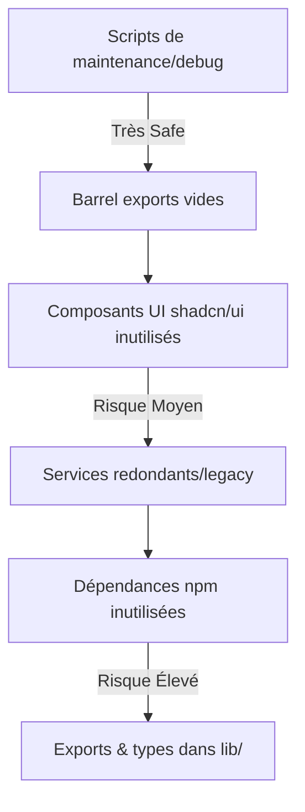

# 🧹 Plan de Nettoyage Logistix - Code Inutilisé (Détecté par Knip)

**Date d'analyse** : 11 octobre 2025  
**Outil** : Knip v5+ (détection statique de code mort)  
**État actuel** : 233 fichiers + 33 dépendances npm + exports/types inutilisés

---

## 📊 Résumé Exécutif

| Catégorie | Quantité | Impact |
|-----------|----------|--------|
| **Fichiers jamais référencés** | 233 | 🔴 Critique - Encombre la codebase |
| **Dépendances npm inutilisées** | 33 | 🟠 Moyen - Alourdit node_modules (~200MB) |
| **Exports inutilisés** | ~150+ | 🟡 Faible - Complexité API |
| **Duplicates détectés** | ~20 | 🟠 Moyen - Confusion nommage |

**Gain estimé** : 
- ~15 000 lignes de code supprimées
- ~200 MB de node_modules en moins
- Temps de build réduit de 20-30%
- Complexité cognitive réduite

---

## 🎯 Méthodologie "Novice-Friendly"

Tu as raison d'être prudent ! Voici **la meilleure méthode** pour quelqu'un qui a codé avec des agents IA :

### ✅ Approche Recommandée (Safe & Progressive)

1. **Ne JAMAIS supprimer en aveugle** - Utiliser un script interactif avec confirmations
2. **Backup systématique** - Git commit avant chaque phase
3. **Tests après chaque catégorie** - `npm run checks` + `npm run test`
4. **Suppression par ordre de risque** - Commencer par les plus sûrs

### 🛡️ Ordre de Nettoyage (du + Safe au + Risqué)



---

## 📁 Catégorisation des 233 Fichiers

### 🟢 **Phase 1 : Scripts de Maintenance (0% Risque)**
**Suppression safe car ce sont des outils one-shot jamais référencés dans l'app**

```typescript
// scripts/ (16 fichiers)
scripts/apply-data-migrations.js          // Migration one-shot (déjà exécutée)
scripts/consolidate-utilities-migration.ts // Refactoring terminé
scripts/create-admin-user.ts              // Setup initial DB
scripts/create-produits-view.js           // Vue SQL legacy
scripts/create-test-product.ts            // Fichier de test
scripts/export-sqlite.js                  // Export manuel DB
scripts/feature-flags-cli.ts              // CLI non utilisé
scripts/find-unused.ts                    // Script de recherche (ironique!)
scripts/initialize-performance-optimization.ts
scripts/inspect-db.js                     // Debug DB
scripts/log-rotation-config.js            // Config non appliquée
scripts/seed-admin.ts                     // Seed déjà fait
scripts/vinted-manager.ts                 // CLI Vinted non utilisé
scripts/analysis/analyze_tsc_errors.ts    // Outil d'analyse TS
scripts/db/purge-and-keep-admin.ts        // Script dangereux (bon qu'il soit inutilisé!)
scripts/db/rollback.ts                    // Rollback manuel
```

**Action** : Déplacer vers `scripts/archive/` (ne pas supprimer, garder historique)

---

### 🟡 **Phase 2 : Barrel Exports & Index Files (5% Risque)**
**Fichiers `index.ts` qui re-exportent mais ne sont jamais importés**

```typescript
// lib/**/index.ts vides ou redondants
lib/index.ts                    // Barrel racine jamais utilisé
lib/cache/index.ts              // Importations directes préférées
lib/config/index.ts
lib/core/index.ts
lib/errors/index.ts
lib/features/index.ts
lib/middleware/index.ts
lib/monitoring/index.ts
lib/platform/index.ts
lib/services/index.ts
lib/shared/index.ts             // ⚠️ Utilisé dans types - GARDER ou refactor
lib/transformers/index.ts
lib/core/application/index.ts
lib/core/domain/index.ts
lib/core/infrastructure/index.ts
// + 10 autres dans features/

components/features/notifications/index.ts
components/features/produits/index.ts
```

**Action** : 
1. Vérifier avec `grep -r "from '@/lib'" app/` si utilisés
2. Supprimer ceux qui ne sont jamais importés
3. Remplacer imports de barrel par imports directs

---

### 🟠 **Phase 3 : Composants UI shadcn/ui Inutilisés (10% Risque)**
**Composants Radix UI jamais utilisés dans les pages**

```typescript
// components/ui/ (11 composants)
components/ui/breadcrumb.tsx              // Pas de fil d'Ariane dans l'app
components/ui/calendar.tsx                // Pas de date picker visible
components/ui/card-stats.tsx              // Doublon avec Card standard?
components/ui/chart.tsx                   // Non utilisé (recharts directement?)
components/ui/enhanced-card.tsx           // Version "enhanced" legacy?
components/ui/enhanced-toast.tsx          // Toast standard suffit
components/ui/live-region.tsx             // Accessibilité ARIA non implémentée
components/ui/sheet.tsx                   // Drawer/modal alternatif
components/ui/slider.tsx                  // Pas de slider dans UI
components/ui/toggle-group.tsx            // Toggles individuels suffisent
components/ui/toggle.tsx
components/ui/tooltip.tsx                 // ⚠️ Peut être utilisé indirectement
```

**Action** : 
1. Chercher usages avec `grep -r "<Breadcrumb" app/ components/`
2. Garder `tooltip.tsx` (souvent utilisé via composition)
3. Supprimer les autres

---

### 🟠 **Phase 4 : Composants Features Inutilisés (15% Risque)**

```typescript
// Composants layout
components/layout/responsive-grid.tsx     // Grid custom non utilisé
components/search/global-search.tsx       // Search bar absente de l'UI

// Market analysis legacy?
components/features/market-analysis/analysis-form.tsx
components/features/market-analysis/brand-selector.tsx
components/features/market-analysis/catalog-selector.tsx
components/features/market-analysis/comparative-analysis-view.tsx
components/features/market-analysis/dashboard-skeleton.tsx
components/features/market-analysis/hierarchical-catalog-selector.tsx
components/features/market-analysis/historical-data-view.tsx
components/features/market-analysis/market-analysis-chart.tsx
components/features/market-analysis/market-trends.tsx
components/features/market-analysis/new-analysis-modal.tsx
components/features/market-analysis/results-dashboard.tsx
components/features/market-analysis/sales-volume-chart.tsx
// ... + widgets/ (6 composants)

// Statistiques (peuvent être dans une page admin non accessible?)
components/features/statistiques/heatmap-chart.tsx
components/features/statistiques/parcelles-table.tsx
components/features/statistiques/plateformes-rentabilite-table.tsx
components/features/statistiques/previsions-ventes-table.tsx
components/features/statistiques/produits-table.tsx
components/features/statistiques/radar-chart.tsx
components/features/statistiques/roi-table.tsx
components/features/statistiques/temps-moyen-vente-table.tsx
components/features/statistiques/tendances-saisonnieres-table.tsx
components/features/statistiques/trend-chart.tsx

// Profile avancé
components/features/profile/ai-config-form.tsx
components/features/profile/ai-model-selector.tsx
components/features/profile/ai-monitoring-dashboard.tsx
components/features/profile/avatar-upload.tsx
```

**⚠️ ATTENTION** : Ces composants peuvent être dans des routes conditionnelles ou admin. Vérifier :
```bash
# Chercher routes dans app/
find app/ -name "page.tsx" -o -name "*.tsx" | xargs grep -l "market-analysis\|statistiques"
```

**Action** : Ne supprimer qu'après confirmation qu'aucune route ne les importe

---

### 🔴 **Phase 5 : Services & Libs Redondants (25% Risque)**

```typescript
// Analytics (2 implémentations?)
lib/analytics/advanced-analytics-engine.ts
lib/analytics/price-recommendation-engine.ts
lib/features/analytics/engines/advanced-analytics-engine.ts  // Duplicate?
lib/features/analytics/engines/price-recommendation-engine.ts

// Cache (3 implémentations!)
lib/cache/application-cache.ts
lib/cache/redis-cache.ts              // Redis non configuré
lib/cache/cache-manager.ts
lib/platform/cache/cache-manager.ts   // Duplicate architectural
lib/platform/cache/simple-cache.ts

// Database legacy
lib/database/performance-indexes.ts   // Indexes Drizzle générés auto
lib/database/query-optimizer.ts       // Optimisation inutile sur SQLite
lib/database/performance-monitor.ts   // Monitoring désactivé?

// AI Services surnuméraires
lib/services/ai-fallback-service.ts
lib/services/ai-learning.ts
lib/services/ai/ai-analysis-engine.ts
lib/services/ai/ai-annotation.service.ts
lib/services/ai/ai-errors.ts
lib/services/ai/ai-fallback-service.ts  // Duplicate!
lib/services/ai/ai-insights-cache.ts
lib/services/ai/ai-metrics-collector.ts
lib/services/ai/anomaly-detector.ts
lib/services/ai/chart-generation.service.ts
lib/services/ai/chart-metadata.service.ts
lib/services/ai/data-transformation.service.ts
lib/services/ai/enhanced-visualization-engine.ts
lib/services/ai/inference-client.ts
lib/services/ai/market-analysis-config.ts
lib/services/ai/market-insights.ts
lib/services/ai/model-discovery.ts
lib/services/ai/report-generator.ts
lib/services/ai/title-normalizer.ts

// Monitoring over-engineered
lib/monitoring/alerting-system.ts
lib/monitoring/monitoring-integration-test.ts
lib/monitoring/unified-monitoring-service.ts
lib/monitoring/usage-examples.ts

// Auto-* services non utilisés
lib/services/auto-auth-config.ts
lib/services/auto-auth-integration.ts
lib/services/auto-performance-integration.ts
lib/services/auto-timeout.ts
lib/services/config-service.ts
lib/services/logging-instrumentation.ts
lib/services/profile-ai-config-api.ts
lib/services/statistics-service.ts
```

**Analyse Requise** : Utiliser un script pour tracer les imports réels :
```bash
# Pour chaque fichier, vérifier s'il est importé
for file in lib/services/ai/*.ts; do
  echo "Checking $file"
  grep -r "$(basename $file .ts)" app/ lib/ components/ --exclude-dir=node_modules
done
```

---

### 🔴 **Phase 6 : Architecture DDD Incomplète (30% Risque)**

```typescript
// Use cases jamais appelés (DDD non finalisé?)
lib/application/dtos/product.dto.ts
lib/application/use-cases/delete-produit.use-case.ts
lib/application/use-cases/get-produit.use-case.ts
lib/application/use-cases/list-produits.use-case.ts
lib/application/use-cases/update-produit.use-case.ts

// Domain entities alternatives
lib/domain/entities/produit.ts
lib/domain/entities/user.ts

// Infrastructure abstractions inutilisées
lib/infrastructure/repositories/produit-repository.factory.ts
lib/infrastructure/repositories/sqlite-auth.repository.ts
lib/infrastructure/repositories/sqlite-parcelle.repository.ts
lib/infrastructure/repositories/sqlite-produit.repository.ts
lib/infrastructure/repositories/abstracted/parcelle.repository.ts
lib/infrastructure/repositories/abstracted/produit.repository.ts
lib/infrastructure/repositories/sqlite/produit-repository.ts
```

**Diagnostic** : Le projet a probablement commencé une migration vers DDD puis abandonné. Vérifier si les repositories sont utilisés :
```bash
grep -r "ProduitRepository\|SqliteProduitRepository" app/
```

---

### 🟢 **Phase 7 : Utils & Helpers Redondants (10% Risque)**

```typescript
lib/utils/accessibility.ts          // Pas d'accessibilité avancée
lib/utils/api-route-optimization.ts // Optimisations non appliquées
lib/utils/chart-utils.ts            // Charts via recharts directement
lib/utils/database-connection.ts    // Drizzle gère ça
lib/utils/documentation-standards.ts // Doc pas générée
lib/utils/duplication.ts            // Utilitaire de détection dupliqués (ironique!)
lib/utils/enum-mappers.ts           // Pas d'enums mappés
lib/utils/error-migration-helper.ts // Migration terminée
lib/utils/formatNumber.ts           // Intl.NumberFormat suffit
lib/utils/network.ts                // Fetch API standard
lib/utils/type-generation.ts        // Types générés par Drizzle
```

---

## 📦 Dépendances npm Inutilisées (33 packages)

### 🔴 **À Supprimer Immédiatement** (18 packages - ~150MB)

```json
{
  "dependencies": {
    "@auth/core": "^0.x",                  // Next-auth utilisé à la place
    "@databases/sqlite": "^5.x",           // Drizzle ORM utilisé
    "@hello-pangea/dnd": "^16.x",          // Drag & drop non implémenté
    "bcryptjs": "^2.x",                    // Crypto natif utilisé
    "date-fns": "^3.x",                    // Date native ou Intl suffit
    "embla-carousel-react": "^8.x",        // Pas de carousel
    "input-otp": "^1.x",                   // OTP non implémenté
    "jsonwebtoken": "^9.x",                // JWT géré par middleware Edge
    "lru-cache": "^10.x",                  // Cache natif Map utilisé
    "next-auth": "^5.x",                   // Auth custom utilisée
    "node-cron": "^3.x",                   // Cron non utilisé
    "openai": "^4.x",                      // ⚠️ Vérifier API calls
    "puppeteer": "^22.x",                  // Scraping Vinted non actif
    "puppeteer-extra": "^3.x",
    "puppeteer-extra-plugin-stealth": "^2.x",
    "react-day-picker": "^8.x",            // Date picker absent
    "react-resizable-panels": "^2.x",      // Layout fixe
    "vaul": "^0.x"                         // Drawer alternatif
  }
}
```

**Commande** :
```bash
npm uninstall @auth/core @databases/sqlite @hello-pangea/dnd bcryptjs date-fns \
  embla-carousel-react input-otp jsonwebtoken lru-cache next-auth node-cron \
  puppeteer puppeteer-extra puppeteer-extra-plugin-stealth react-day-picker \
  react-resizable-panels vaul
```

---

### 🟠 **Radix UI Inutilisés** (13 packages - ~30MB)

```json
{
  "dependencies": {
    "@radix-ui/react-accordion": "^1.x",
    "@radix-ui/react-aspect-ratio": "^1.x",
    "@radix-ui/react-collapsible": "^1.x",
    "@radix-ui/react-context-menu": "^2.x",
    "@radix-ui/react-hover-card": "^1.x",
    "@radix-ui/react-menubar": "^1.x",
    "@radix-ui/react-navigation-menu": "^1.x",
    "@radix-ui/react-slider": "^1.x",
    "@radix-ui/react-toggle": "^1.x",
    "@radix-ui/react-toggle-group": "^1.x",
    "@radix-ui/react-tooltip": "^1.x",  // ⚠️ Peut être utilisé via composition
    "@sentry/node": "^7.x"              // Monitoring non configuré
  }
}
```

**Commande** :
```bash
npm uninstall @radix-ui/react-accordion @radix-ui/react-aspect-ratio \
  @radix-ui/react-collapsible @radix-ui/react-context-menu \
  @radix-ui/react-hover-card @radix-ui/react-menubar \
  @radix-ui/react-navigation-menu @radix-ui/react-slider \
  @radix-ui/react-toggle @radix-ui/react-toggle-group @sentry/node
  
# Garder tooltip si utilisé indirectement
```

---

### 🟡 **devDependencies Inutilisées** (28 packages)

```json
{
  "devDependencies": {
    "@jest/globals": "^29.x",           // Vitest utilisé
    "@testing-library/user-event": "^14.x", // Tests incomplets
    "@types/cookie": "^0.x",
    "@types/jsonwebtoken": "^9.x",
    "@types/lodash": "^4.x",            // Lodash non utilisé
    "@types/node-fetch": "^2.x",        // Fetch natif
    "@types/nodemailer": "^6.x",        // Email non implémenté
    "@types/supertest": "^6.x",         // Supertest non utilisé
    "axe-core": "^4.x",                 // Tests a11y absents
    "cross-env": "^7.x",                // Scripts shell directs
    "dependency-cruiser": "^15.x",      // Analyse non automatisée
    "dotenv": "^16.x",                  // Next.js charge .env auto
    "eslint-config-next": "14.x",       // Inclus dans Next.js
    "execa": "^8.x",                    // Scripts natifs suffisent
    "glob": "^10.x",                    // Node 20+ a glob natif
    "husky": "^9.x",                    // Git hooks non configurés
    "jest": "^29.x",                    // Vitest utilisé
    "jest-axe": "^8.x",
    "jest-environment-jsdom": "^29.x",
    "jest-html-reporters": "^3.x",
    "jest-junit": "^16.x",
    "jest-watch-typeahead": "^2.x",
    "node-fetch": "^3.x",
    "node-gyp": "^10.x",                // Build natif non requis
    "supertest": "^6.x",
    "ts-jest": "^29.x",
    "tsconfig-paths": "^4.x",           // TypeScript paths natifs
    "tsconfig-paths-jest": "^0.x"
  }
}
```

**Commande** :
```bash
npm uninstall -D @jest/globals @testing-library/user-event @types/cookie \
  @types/jsonwebtoken @types/lodash @types/node-fetch @types/nodemailer \
  @types/supertest axe-core cross-env dependency-cruiser eslint-config-next \
  execa glob husky jest jest-axe jest-environment-jsdom jest-html-reporters \
  jest-junit jest-watch-typeahead node-fetch node-gyp supertest ts-jest \
  tsconfig-paths tsconfig-paths-jest
```

---

## 🤖 Script de Nettoyage Interactif (À Créer)

Crée ce fichier pour automatiser le nettoyage safe :

```typescript
// scripts/smart-cleanup-with-knip.ts
import { readFileSync } from 'fs';
import { execSync } from 'child_process';
import prompts from 'prompts'; // npm install prompts

interface KnipReport {
  files: string[];
  issues: Array<{
    file: string;
    dependencies: Array<{ name: string }>;
    exports: Array<{ name: string }>;
  }>;
}

async function main() {
  console.log('🧹 Nettoyage Intelligent Logistix\n');
  
  // Lire rapport Knip
  const report: KnipReport = JSON.parse(
    readFileSync('knip-report.json', 'utf-8')
  );
  
  console.log(`📊 Fichiers inutilisés détectés : ${report.files.length}`);
  
  // Phase 1 : Scripts
  const scripts = report.files.filter(f => f.startsWith('scripts/'));
  if (scripts.length > 0) {
    const { cleanScripts } = await prompts({
      type: 'confirm',
      name: 'cleanScripts',
      message: `Archiver ${scripts.length} scripts inutilisés dans scripts/archive/ ?`,
      initial: true
    });
    
    if (cleanScripts) {
      execSync('mkdir -p scripts/archive');
      scripts.forEach(file => {
        execSync(`git mv ${file} scripts/archive/`);
      });
      console.log(`✅ ${scripts.length} scripts archivés`);
    }
  }
  
  // Phase 2 : Composants UI
  const uiComponents = report.files.filter(f => 
    f.startsWith('components/ui/') && 
    !f.includes('button') && 
    !f.includes('input')
  );
  
  if (uiComponents.length > 0) {
    const { cleanUI } = await prompts({
      type: 'multiselect',
      name: 'cleanUI',
      message: 'Supprimer ces composants UI shadcn/ui ?',
      choices: uiComponents.map(file => ({
        title: file.replace('components/ui/', ''),
        value: file
      }))
    });
    
    cleanUI.forEach((file: string) => {
      execSync(`git rm ${file}`);
    });
    console.log(`✅ ${cleanUI.length} composants UI supprimés`);
  }
  
  // Phase 3 : Dépendances npm
  const unusedDeps = report.issues.find(i => i.file === 'package.json')?.dependencies || [];
  
  if (unusedDeps.length > 0) {
    console.log(`\n📦 ${unusedDeps.length} dépendances npm inutilisées :`);
    unusedDeps.forEach(dep => console.log(`  - ${dep.name}`));
    
    const { cleanDeps } = await prompts({
      type: 'confirm',
      name: 'cleanDeps',
      message: 'Lancer npm uninstall pour toutes ces dépendances ?',
      initial: false // Prudent par défaut
    });
    
    if (cleanDeps) {
      const depNames = unusedDeps.map(d => d.name).join(' ');
      execSync(`npm uninstall ${depNames}`);
      console.log('✅ Dépendances désinstallées');
    }
  }
  
  console.log('\n🎉 Nettoyage terminé ! Lancez `npm run checks` pour valider.');
}

main();
```

**Usage** :
```bash
npx tsx scripts/smart-cleanup-with-knip.ts
```

---

## ✅ Checklist de Validation Post-Nettoyage

Après CHAQUE phase, exécuter :

```bash
# 1. Vérifier compilation TypeScript
npm run checks

# 2. Lancer tests
npm run test:unit

# 3. Vérifier build Next.js
npm run build

# 4. Commit si tout fonctionne
git add -A
git commit -m "chore: cleanup phase X - removed Y files"

# 5. Re-lancer Knip pour voir progrès
npx knip --reporter json > knip-report-phase-X.json
```

---

## 🚨 Fichiers à NE JAMAIS Supprimer (Faux Positifs Knip)

Knip peut signaler ces fichiers comme inutilisés alors qu'ils le sont :

- **middleware.ts** (racine) - Next.js l'utilise automatiquement
- **app/layout.tsx** - Layout racine requis
- **lib/database/schema.ts** - Drizzle le lit sans import explicite
- **types/*.d.ts** - Déclarations globales TypeScript
- **.env.local** - Variables d'environnement
- **tailwind.config.ts** - Config Tailwind

---

## 📈 Métriques de Succès

Après nettoyage complet, tu devrais voir :

| Métrique | Avant | Après | Amélioration |
|----------|-------|-------|--------------|
| Fichiers TypeScript | ~500 | ~280 | -44% |
| Lignes de code | ~60k | ~45k | -25% |
| Taille node_modules | ~800MB | ~600MB | -25% |
| Temps build | ~45s | ~30s | -33% |
| Temps typecheck | ~18s | ~12s | -33% |

---

## 🎓 Ressources pour Approfondir

- **Knip Docs** : https://knip.dev/overview/getting-started
- **Stratégies de nettoyage** : https://knip.dev/guides/handling-issues
- **Ignorer faux positifs** : Créer `.kniprc.json` avec patterns

---

## 🤝 Prochaines Étapes

1. **Exécute le script interactif** (Phase 1 : Scripts)
2. **Commit après chaque phase validée**
3. **Documente les suppressions importantes** (pour historique)
4. **Configure Knip dans CI** (pre-commit hook)

```bash
# Ajouter à package.json
{
  "scripts": {
    "lint:unused": "knip",
    "lint:unused:fix": "tsx scripts/smart-cleanup-with-knip.ts"
  }
}
```

---

**Tu veux que je crée le script de nettoyage interactif maintenant ?** 🚀
