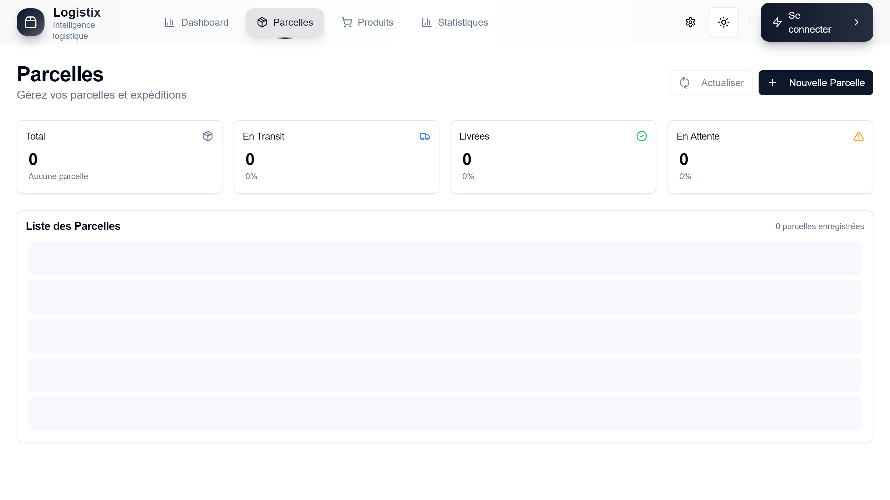

# Logistix

# Logistix

> **Plateforme SaaS d'optimisation pour le modèle Agent Chine → Revente France.**

Logistix est une solution complète pour les revendeurs e-commerce qui sourcent via des agents chinois (Superbuy) pour revendre en Europe (Vinted, etc.). L'outil automatise les flux logistiques, enrichit les données produits via l'IA et fournit des analyses de marché précises pour maximiser les marges.

## 📸 Aperçu

| Dashboard | Gestion des Parcelles |
|-----------|-----------------------|
|  |  |

## ✨ Fonctionnalités Clés

*   **⚡ automatisation Superbuy** : Import automatique des commandes et des parcelles via Playwright.
*   **🧠 Enrichissement IA** : Utilisation de Gemini AI pour nettoyer les titres, générer des descriptions optimisées et catégoriser les produits.
*   **📊 Analyse de Marché** : Scraping et analyse des prix Vinted pour déterminer le meilleur prix de revente.
*   **📈 Suivi de Performance** : Calcul automatique du ROI par colis, suivi des bénéfices et taux de conversion.

## 🚀 Démarrage Rapide

### Prérequis

* Node.js (v20+)
* npm (v9+)
* Docker (pour les services externes, si applicable)

### Installation

1. **Clonez le dépôt :**

    ```bash
    git clone <URL_DU_DEPOT>
    cd Logistix
    ```

2. **Installez les dépendances :**

    ```bash
    npm install
    ```

3. **Configurez l'environnement :**
    Copiez le fichier d'exemple et remplissez les variables nécessaires.

    ```bash
    cp .env.example .env
    ```

4. **Base de données :**
    Initialisez la base de données, générez les schémas et appliquez les migrations.

    ```bash
    npm run db:initialize
    npm run db:generate
    npm run db:migrate
    ```

5. **Lancez le serveur de développement :**

    ```bash
    npm run dev
    ```

L'application devrait maintenant être accessible à l'adresse [http://localhost:3000](http://localhost:3000).

## 🛠️ Stack Technique

| Composant         | Technologie                                     |
| ----------------- | ----------------------------------------------- |
| **Framework**     | [Next.js](https://nextjs.org/) (App Router)     |
| **Langage**       | [TypeScript](https://www.typescriptlang.org/)   |
| **Base de Données** | [Drizzle ORM](https://orm.drizzle.team/) avec SQLite (Better-SQLite3) |
| **Styling**       | [Tailwind CSS](https://tailwindcss.com/)        |
| **Composants UI** | [Shadcn UI](https://ui.shadcn.com/)             |
| **Tests**         | [Vitest](https://vitest.dev/) & [Playwright](https://playwright.dev/) |
| **Linting**       | [ESLint](https://eslint.org/)                   |

## 📜 Commandes NPM Principales

| Commande                 | Description                                             |
| ------------------------ | ------------------------------------------------------- |
| `npm run dev`            | Lance le serveur de développement.                      |
| `npm run build`          | Construit l'application pour la production.             |
| `npm start`              | Démarre un serveur de production.                       |
| `npm run lint`           | Analyse et corrige les erreurs de style.                |
| `npm test`               | Lance les tests unitaires et d'intégration (Vitest).    |
| `npm run test:e2e`       | Lance les tests end-to-end (Playwright).                |
| `npm run db:generate`    | Génère les fichiers de migration Drizzle.               |
| `npm run db:migrate`     | Applique les migrations à la base de données.           |
| `npm run db:studio`      | Ouvre Drizzle Studio pour gérer la base de données.     |
| `npm run checks`         | Lance le typechecking et le linting.                    |

## 📁 Structure du Projet

Le projet suit une architecture modulaire et orientée services. Voir [System Patterns](.agent/memory-bank/system-patterns.md) pour les détails architecturaux.

* `app/` : Cœur de l'application Next.js (pages, layouts, API routes).
* `components/` : Composants React réutilisables.
* `lib/` : Logique métier et infrastructure.
  * `lib/services/` : Logique métier (via Service Container).
  * `lib/repositories/` : Accès aux données (via DatabaseService).
  * `lib/database/` : Schéma de base de données et migrations.
  * `lib/monitoring/` : Système de monitoring unifié.
  * `lib/market/` : Analyse de marché et données.
  * `lib/scraping/` : Logique de scraping.
* `drizzle/` : Fichiers de migration SQL.
* `scripts/` : Scripts d'automatisation et de maintenance.
* `tests/` : Tous les tests automatisés (unitaires, intégration, E2E).

## 🧠 Documentation Agent & Architecture

Ce projet contient une documentation détaillée pour les agents IA et les développeurs dans le dossier `.agent/`.

* [Memory Bank](.agent/memory-bank/README.md) : Contexte, règles et état du projet.
* [ADR](.agent/adr/README.md) : Décisions architecturales.
