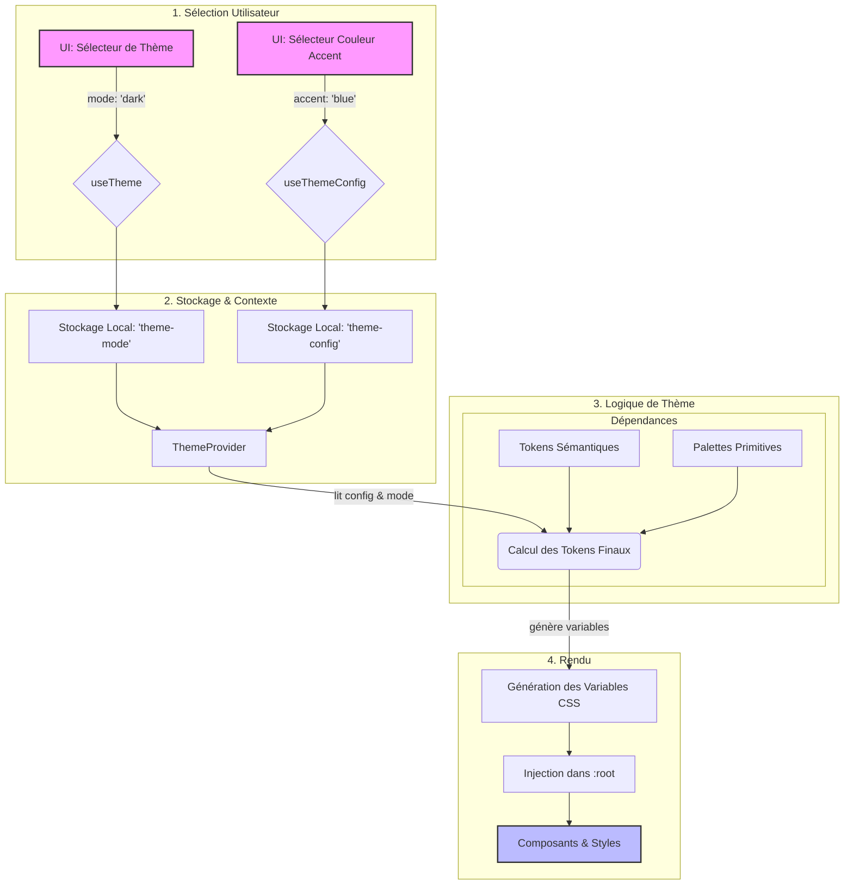

# Architecture de Thème et de Personnalisation

Ce document détaille la nouvelle architecture pour la gestion du thème, de la couleur d'accent et de la personnalisation de l'interface.

## 1. Structure des Fichiers et Format des Tokens

Une structure de fichiers claire et une définition rigoureuse des tokens sont le fondement d'un système de thème maintenable et évolutif.

### 1.1. Arborescence des Fichiers

L'organisation des fichiers sera centralisée dans `lib/theme` pour séparer clairement la logique de theming du reste du Design System.

```tree
lib/
└── theme/
    ├── tokens/
    │   ├── colors.ts         # Définition des palettes de couleurs de base (primitive tokens)
    │   ├── semantic.ts       # Mappage sémantique des couleurs (ex: 'background', 'text-primary')
    │   └── index.ts          # Point d'entrée pour tous les tokens (couleurs, spacing, etc.)
    │
    ├── utils/
    │   ├── css-variables.ts  # Fonctions pour générer et appliquer les variables CSS
    │   └── color.ts          # Utilitaires pour la manipulation des couleurs (contrast, hsl, etc.)
    │
    ├── hooks/
    │   ├── useTheme.ts       # Hook principal pour accéder et modifier le thème
    │   └── useThemeConfig.ts # Hook pour gérer la configuration utilisateur (accent, etc.)
    │
    ├── ThemeProvider.tsx     # Provider React principal qui injecte le thème
    ├── index.ts              # Exporte les composants et hooks publics du module
    └── types.ts              # Définitions TypeScript pour le thème
```

### 1.2. Format des Tokens

Nous adoptons une approche à deux niveaux pour les tokens de couleur afin de découpler les palettes de base de leur usage sémantique. Les valeurs seront stockées au format HSL (Teinte, Saturation, Luminosité) pour faciliter la manipulation dynamique.

#### a) Tokens Primitifs (`lib/theme/tokens/colors.ts`)

Ces tokens définissent les palettes de couleurs brutes disponibles. Ils ne sont pas directement utilisés dans les composants.

```typescript
// lib/theme/tokens/colors.ts

export type ColorScale = {
  50: string;  // Format "H S L" (ex: "210 40% 96.1%")
  100: string;
  // ...
  900: string;
  950: string;
};

export const blue: ColorScale = { /* ... HSL values ... */ };
export const gray: ColorScale = { /* ... HSL values ... */ };
export const red: ColorScale = { /* ... HSL values ... */ };
// ... autres palettes de base

export const basePalettes = { blue, gray, red };
```

#### b) Tokens Sémantiques (`lib/theme/tokens/semantic.ts`)

Ces tokens donnent un sens aux couleurs primitives et sont ceux utilisés dans l'application. Ils se mappent aux variables CSS. Chaque token sémantique est défini pour les modes `light`, `dark` et `high-contrast`.

```typescript
// lib/theme/tokens/semantic.ts
import { blue, gray, red } from './colors';

// Les noms de tokens sont indépendants des couleurs réelles
export const semanticTokens = {
  light: {
    // Variable CSS: --background
    background: gray[50],          // "210 40% 98%"
    // Variable CSS: --foreground
    foreground: gray[900],         // "222.2 47.4% 11.2%"
    // Variable CSS: --primary
    primary: blue[600],            // "221.2 83.2% 53.3%"
    // Variable CSS: --primary-foreground
    primaryForeground: gray[50],   // "210 40% 98%"
    // Variable CSS: --destructive
    destructive: red[500],
    // ... etc.
  },
  dark: {
    background: gray[950],
    foreground: gray[200],
    primary: blue[500],
    primaryForeground: gray[900],
    destructive: red[600],
    // ... etc.
  },
  'high-contrast': {
    background: "0 0% 0%",      // Noir
    foreground: "0 0% 100%",    // Blanc
    primary: "60 100% 50%",     // Jaune vif
    primaryForeground: "0 0% 0%",
    destructive: "0 100% 50%",
    // ... etc.
  }
};
```

### 1.3. Configuration Utilisateur (`lib/theme/hooks/useThemeConfig.ts`)

La configuration spécifique à l'utilisateur (comme la couleur d'accent) sera stockée séparément et fusionnée au moment de la génération des CSS.

```typescript
// Représentation de l'état géré par useThemeConfig
export interface ThemeUserConfig {
  accentColor: keyof typeof basePalettes; // 'blue', 'red', etc.
  borderRadius: 'sm' | 'md' | 'lg';
  // ... autres préférences
}
```

Cette structure établit une base solide, décorrélant les choix de design (palettes) de leur application (sémantique), tout en isolant la personnalisation utilisateur.

## 2. Flux de Données du Thème

Le flux de données est conçu pour être unidirectionnel et réactif, garantissant que toute modification de thème ou de configuration se propage de manière prévisible dans toute l'application.

Le diagramme Mermaid ci-dessous illustre ce flux :



### Étapes du Flux

1. **Sélection Utilisateur** : L'utilisateur interagit avec des composants d'interface (ex: `ThemeToggle`, `AccentColorPicker`). Ces actions invoquent les hooks `useTheme` ou `useThemeConfig`.

2. **Mise à jour et Stockage** :
    * Les hooks mettent à jour leur état interne respectif.
    * Les nouvelles valeurs (`mode` et `config`) sont persistées dans le `localStorage` pour conserver les choix entre les sessions.

3. **Propagation via Provider** :
    * Le `ThemeProvider`, qui encapsule l'application, détecte le changement d'état.
    * Il lit les valeurs à jour depuis le `localStorage` et son propre état.

4. **Calcul des Tokens** :
    * Le `ThemeProvider` combine plusieurs sources pour calculer le jeu final de tokens à appliquer :
        1. Il sélectionne le bon jeu de **tokens sémantiques** (`light`, `dark` ou `high-contrast`) en fonction du `mode` de thème résolu.
        2. Il identifie la **palette de couleur d'accent** (ex: `blue`) choisie par l'utilisateur dans la configuration.
        3. Il remplace dynamiquement les tokens sémantiques liés à l'accent (ex: `primary`, `primary-foreground`) par les valeurs correspondantes de la palette d'accent sélectionnée.

5. **Génération des Variables CSS** :
    * Une fonction utilitaire (`generateCSSVariables`) prend le jeu de tokens finaux et le transforme en un objet de variables CSS.
    * Exemple : `{ '--background': '210 40% 98%', '--primary': '221.2 83.2% 53.3%' }`.

6. **Injection et Rendu** :
    * Les variables CSS sont injectées dynamiquement sur l'élément `:root` du document.
    * Les CSS de l'application (ex: via Tailwind) qui utilisent ces variables (`bg-background`, `text-primary`, etc.) se mettent à jour instantanément, modifiant l'apparence de l'interface sans nécessiter de re-rendu manuel des composants.

## 3. Stratégie des Variables CSS

L'utilisation des variables CSS est au cœur de notre système. Elle permet des mises à jour dynamiques sans recharger la page et assure une intégration parfaite avec Tailwind CSS.

### 3.1. Convention de Nommage

Les variables sont nommées de manière sémantique pour refléter leur usage, et non leur valeur.

* **Format** : `--nom-sémantique`
* **Exemples** :
  * `--background`
  * `--foreground`
  * `--primary`
  * `--primary-foreground`
  * `--card`
  * `--destructive`
  * `--radius`
  * `--chart-1`

### 3.2. Injection des Variables

Les variables sont générées côté client par le `ThemeProvider` et injectées dans l'élément `:root`.

```javascript
// Dans ThemeProvider.tsx

// 1. Calcul des tokens finaux (objet JS)
const finalTokens = {
  background: "0 0% 100%", // HSL pour le mode light
  primary: "262.1 83.3% 57.8%", // HSL pour l'accent violet
  // ...
};

// 2. Transformation en variables CSS et injection
Object.entries(finalTokens).forEach(([key, value]) => {
  document.documentElement.style.setProperty(`--${key}`, value);
});
```

Cette approche garantit que les variables sont toujours synchronisées avec l'état du thème React.

### 3.3. Intégration avec Tailwind CSS

L'intégration avec Tailwind se fait dans le fichier `tailwind.config.js`. Nous mappons les noms de couleurs de Tailwind aux variables CSS que nous avons définies.

```javascript
// tailwind.config.js

module.exports = {
  theme: {
    extend: {
      colors: {
        border: 'hsl(var(--border))',
        input: 'hsl(var(--input))',
        ring: 'hsl(var(--ring))',
        background: 'hsl(var(--background))',
        foreground: 'hsl(var(--foreground))',
        primary: {
          DEFAULT: 'hsl(var(--primary))',
          foreground: 'hsl(var(--primary-foreground))',
        },
        secondary: {
          DEFAULT: 'hsl(var(--secondary))',
          foreground: 'hsl(var(--secondary-foreground))',
        },
        destructive: {
          DEFAULT: 'hsl(var(--destructive))',
          foreground: 'hsl(var(--destructive-foreground))',
        },
        // ... autres couleurs sémantiques
      },
      borderRadius: {
        lg: 'var(--radius)',
        md: 'calc(var(--radius) - 2px)',
        sm: 'calc(var(--radius) - 4px)',
      },
      // ...
    },
  },
};
```

**Avantages de cette approche :**

* **Source de Vérité Unique** : La logique du thème (React) est la seule source de vérité. Tailwind ne fait que consommer les variables.
* **Utilisation Naturelle** : Les développeurs continuent d'utiliser les classes Tailwind standard (`bg-background`, `text-primary`, `border-destructive`) sans se soucier de la logique de thème sous-jacente.
* **Performance** : Les changements de thème sont gérés par le moteur CSS du navigateur, ce qui est extrêmement performant.

## 4. Hooks et Provider React

L'interaction avec le système de thème se fera à travers un Provider et des hooks dédiés, offrant une API claire et découplée.

### 4.1. `ThemeProvider`

Le `ThemeProvider` est le composant racine qui orchestre l'ensemble de la logique.

* **Rôle** :
    1. Gérer l'état global du thème (mode, configuration utilisateur).
    2. Écouter les changements du `localStorage` et les préférences système (`prefers-color-scheme`).
    3. Calculer et injecter les variables CSS dans le DOM.
* **Props** :
  * `children`: `React.ReactNode` - L'application.
  * `storageKey`: `string` (optionnel) - Clé pour le `localStorage`.
  * `defaultConfig`: `ThemeUserConfig` (optionnel) - Configuration par défaut.

* **Exemple d'utilisation** (`app/layout.tsx`):

    ```tsx
    import { ThemeProvider } from '@/lib/theme';

    export default function RootLayout({ children }) {
      return (
        <html lang="fr" suppressHydrationWarning>
          <body>
            <ThemeProvider
              storageKey="logistix-theme"
              defaultConfig={{ accentColor: 'blue', borderRadius: 'md' }}
            >
              {children}
            </ThemeProvider>
          </body>
        </html>
      );
    }
    ```

### 4.2. `useTheme()`

Ce hook est le point d'entrée principal pour lire et modifier le thème de base (`light`, `dark`, `system`).

* **Valeurs Retournées** :
  * `theme`: `'light' | 'dark' | 'system'` - Le thème actuellement sélectionné par l'utilisateur.
  * `setTheme`: `(theme: 'light' | 'dark' | 'system') => void` - Fonction pour changer le thème.
  * `resolvedTheme`: `'light' | 'dark'` - Le thème actuellement rendu, résolvant `'system'` en `'light'` ou `'dark'`.

* **Exemple d'utilisation** (dans un composant `ThemeToggle`):

    ```tsx
    import { useTheme } from '@/lib/theme';
    
    function ThemeToggle() {
      const { theme, setTheme } = useTheme();
      // ... UI pour changer le thème
    }
    ```

### 4.3. `useThemeConfig()`

Ce hook gère les options de personnalisation plus fines, comme la couleur d'accent ou le rayon des bordures.

* **Valeurs Retournées** :
  * `config`: `ThemeUserConfig` - L'objet de configuration actuel.
  * `setConfig`: `(newConfig: Partial<ThemeUserConfig>) => void` - Fonction pour mettre à jour la configuration.
  * `accentColorPalette`: `ColorScale` - La palette de couleurs complète correspondant à la couleur d'accent sélectionnée.

* **Exemple d'utilisation** (dans un composant `AccentColorPicker`):

    ```tsx
    import { useThemeConfig } from '@/lib/theme';
    import { basePalettes } from '@/lib/theme/tokens/colors';
    
    function AccentColorPicker() {
      const { config, setConfig } = useThemeConfig();

      const availableAccents = Object.keys(basePalettes);

      return (
        <div>
          {availableAccents.map(colorName => (
            <button onClick={() => setConfig({ accentColor: colorName })}>
              {colorName}
            </button>
          ))}
        </div>
      );
    }
    ```

Ce découplage entre `useTheme` et `useThemeConfig` permet de séparer la gestion du mode global (clair/sombre) des préférences de personnalisation esthétique, simplifiant ainsi la logique des composants.

## 5. Stratégie de Fallback et Plan de Migration

Une migration réussie nécessite une planification minutieuse pour éviter les régressions visuelles et assurer une transition en douceur.

### 5.1. Stratégie de Fallback

Pour les navigateurs très anciens qui ne supporteraient pas les variables CSS, Tailwind CSS gère déjà des fallbacks pour les valeurs de couleur de base définies dans `tailwind.config.js`. Notre architecture s'appuie sur ce comportement.

Le point le plus important est la gestion du "flash of unstyled content" (FOUC) au chargement initial de la page.

* **Anti-FOUC** : Un petit script sera placé dans le `<head>` du document HTML (`app/layout.tsx`) pour lire le thème depuis le `localStorage` et appliquer la classe `dark`, `light` ou `high-contrast` à l'élément `<html>` **avant même que React ne s'initialise**. Cela garantit que le bon thème est appliqué dès le premier rendu du navigateur.

    ```javascript
    // Script à insérer dans le <head>
    (function() {
      try {
        const theme = localStorage.getItem('logistix-theme') || 'system';
        const root = document.documentElement;
        if (theme === 'dark' || (theme === 'system' && window.matchMedia('(prefers-color-scheme: dark)').matches)) {
          root.classList.add('dark');
        } else {
          root.classList.remove('dark');
        }
      } catch (e) {}
    })();
    ```

### 5.2. Plan de Migration Étape par Étape

La migration se fera de manière incrémentale pour minimiser les risques.

1. **Phase 1 : Mise en Place (Infrastructure)**
    * Créer la nouvelle structure de fichiers dans `lib/theme`.
    * Implémenter le nouveau `ThemeProvider`, les hooks, et les définitions de tokens.
    * Intégrer le script anti-FOUC dans `app/layout.tsx`.
    * Envelopper l'application avec le nouveau `ThemeProvider`. À ce stade, l'ancien système est toujours en place.

2. **Phase 2 : Transition des CSS**
    * Mettre à jour `tailwind.config.js` pour utiliser les nouvelles variables CSS (`hsl(var(--...))`).
    * Modifier le fichier `app/globals.css` pour qu'il s'appuie sur les nouvelles variables sémantiques. L'ancien système de classes `light`/`dark` sera remplacé par la logique du `ThemeProvider`.

3. **Phase 3 : Migration des Composants**
    * Remplacer les anciens hooks et contextes de thème par les nouveaux `useTheme` et `useThemeConfig` dans les composants existants (`ThemeToggle`, `ProfileForm`, etc.).
    * Créer les nouveaux composants de personnalisation (ex: `AccentColorPicker`).
    * Rechercher dans toute la codebase les usages de couleurs en dur (`#...` ou `rgb(...)`) et les remplacer par des classes Tailwind sémantiques (`bg-primary`, `text-destructive`, etc.).

4. **Phase 4 : Nettoyage**
    * Supprimer les anciens fichiers de thème (`lib/design-system/theme-provider.tsx`, `lib/hooks/use-theme-config.ts`, etc.) après avoir validé que tout fonctionne.
    * Supprimer les anciennes variables CSS du fichier `globals.css`.
    * Vérifier qu'il ne reste aucune dépendance à l'ancien système.

## 6. Tests à Prévoir et Bénéfices Attendus

### 6.1. Stratégie de Test

Pour garantir la robustesse du système, plusieurs niveaux de tests seront mis en place :

* **Tests Unitaires (Jest / Vitest)** :
  * Tester les fonctions utilitaires pures (`color.ts`, `css-variables.ts`).
  * Tester la logique des hooks en isolation pour vérifier la mise à jour de l'état et l'interaction avec le `localStorage`.

* **Tests d'Intégration (React Testing Library)** :
  * Tester le `ThemeProvider` en enveloppant des composants factices et en vérifiant que les variables CSS sont correctement appliquées au DOM après une modification de thème ou de configuration.
  * Tester les composants de l'interface de personnalisation (`ThemeToggle`, `AccentColorPicker`) pour s'assurer qu'ils interagissent correctement avec les hooks.

* **Tests End-to-End (Cypress / Playwright)** :
  * Simuler des parcours utilisateurs complets :
        1. Charger la page, vérifier le thème par défaut.
        2. Changer le thème en "dark", vérifier que l'apparence change.
        3. Recharger la page, vérifier que le thème "dark" a été persisté.
        4. Changer la couleur d'accent, vérifier que les boutons et liens sont mis à jour.
        5. Activer le mode "high-contrast" (via une simulation ou un hook de test) et vérifier que les styles de contraste élevé sont appliqués.

* **Tests Visuels de Régression (Chromatic / Percy)** :
  * Prendre des captures d'écran des composants clés dans chaque état de thème (light, dark, high-contrast, et avec différentes couleurs d'accent) pour détecter toute régression visuelle non intentionnelle lors de futures modifications.

### 6.2. Bénéfices de la Nouvelle Architecture

Cette refonte apportera des avantages significatifs en termes de maintenabilité, d'expérience utilisateur et de performance.

* **Cohérence Totale** : La source de vérité unique et le flux de données unidirectionnel éliminent les incohérences visuelles. La couleur d'accent, par exemple, sera appliquée de manière fiable partout.

* **Maintenabilité Accrue** :
  * La séparation claire entre tokens primitifs et sémantiques facilite l'ajout de nouvelles couleurs ou de nouveaux thèmes sans impacter le code des composants.
  * Le code est centralisé et plus facile à raisonner.

* **Personnalisation Fiable** : Le système est conçu pour être extensible. L'ajout de nouvelles options de personnalisation (ex: espacement, police) suivra le même modèle que la couleur d'accent, le rendant simple à faire évoluer.

* **Performance Optimale** : En s'appuyant sur les variables CSS natives, les changements de thème sont gérés par le navigateur, ce qui est beaucoup plus performant que des re-rendus React complexes.

* **Accessibilité Native** : Le support du mode `high-contrast` est intégré au cœur du système, garantissant une expérience de qualité pour tous les utilisateurs.

* **Meilleure Expérience Développeur** : Les développeurs n'ont plus à se soucier de la logique de thème. Ils utilisent des classes Tailwind sémantiques, ce qui accélère le développement et réduit les erreurs.
