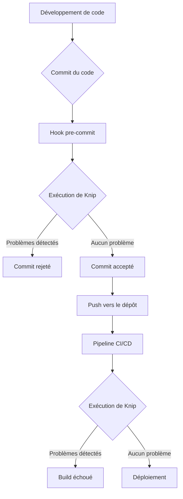

<![CDATA[
# Stratégie de Détection et d'Élimination du Code Mort dans les Projets TypeScript

## 1. Contexte et Objectif

Les projets TypeScript, en particulier ceux générés ou modifiés par des agents IA, peuvent rapidement accumuler du code inutilisé (fichiers, dépendances, exports). Ce "code mort" augmente la complexité de la maintenance, ralentit les builds et peut masquer des bugs.

Ce document a pour objectif de présenter une stratégie claire pour détecter et éliminer ce code mort, en comparant plusieurs outils et en proposant un workflow adapté au projet Logistix.

## 2. Analyse des Outils Disponibles

Plusieurs outils permettent d'automatiser la détection de code mort. Voici une comparaison des options les plus populaires et pertinentes pour un projet Next.js comme Logistix.

### 2.1. Knip (Recommandé)

**Knip** est l'outil le plus complet et le plus puissant actuellement disponible. Il va au-delà de la simple détection d'exports inutilisés et analyse l'ensemble du projet pour trouver :
- Fichiers inutilisés
- Dépendances (`dependencies` et `devDependencies`) inutilisées
- Exports et types inutilisés
- Imports non résolus

**Avantages :**
-   **Analyse Complète** : Couvre tous les aspects du code mort.
-   **Configuration Simple** : `npm init @knip/config` suffit pour démarrer.
-   **Rapports Clairs** : Génère un rapport détaillé (JSON ou console) facile à exploiter.
-   **Intégration Facile** : Peut être ajouté aux scripts `npm` et à la CI/CD.
-   **Conscient des Frameworks** : Possède des plugins pour Next.js, Storybook, etc., ce qui réduit les faux positifs.

**Inconvénients :**
-   Peut nécessiter une configuration fine pour ignorer certains fichiers ou dépendances spécifiques (faux positifs).

**Cas d'usage pour Logistix :**
L'analyse initiale avec Knip sur le projet Logistix a révélé un grand nombre de fichiers, dépendances et exports inutilisés, démontrant son efficacité immédiate. C'est l'outil idéal pour un nettoyage en profondeur et pour maintenir la qualité du code sur le long terme.

### 2.2. ts-prune

**ts-prune** est un outil plus simple et plus léger, focalisé sur une seule chose : trouver les exports TypeScript qui ne sont jamais utilisés.

**Avantages :**
-   **Léger et Rapide** : Pas de configuration nécessaire pour une première analyse.
-   **Facile à lancer** : `npx ts-prune` suffit.
-   **Focalisé** : Fait une seule chose et la fait bien.

**Inconvénients :**
-   **Portée Limitée** : Ne détecte ni les fichiers complètement inutilisés, ni les dépendances inutilisées.
-   **Moins Maintenu** : Le projet est en mode maintenance.
-   **Génère plus de faux positifs** : Peut nécessiter des configurations manuelles pour ignorer certains exports (ex: ceux utilisés implicitement par un framework).

**Cas d'usage pour Logistix :**
Utile pour une vérification rapide des exports inutilisés, mais insuffisant pour un nettoyage complet du projet. Il peut être un bon complément à `tsc` si Knip semble trop lourd pour une vérification ponctuelle.

### 2.3. Compilateur TypeScript (`tsc`)

Le compilateur TypeScript lui-même peut détecter une partie du code mort grâce à des options de configuration dans `tsconfig.json`.

-   `"noUnusedLocals": true` : Signale les variables locales déclarées mais jamais lues.
-   `"noUnusedParameters": true` : Signale les paramètres de fonction jamais utilisés.

**Avantages :**
-   **Intégré** : Aucune dépendance externe à ajouter.
-   **Feedback en temps réel** : Les erreurs sont visibles directement dans l'éditeur de code.

**Inconvénients :**
-   **Très Limité** : Ne détecte que le code inutilisé *à l'intérieur* d'un fichier. Ne peut pas détecter un fichier ou un export entièrement inutilisé.

**Cas d'usage pour Logistix :**
Ces options devraient être activées par défaut dans le `tsconfig.json` du projet pour assurer une propreté de base du code au fil de l'eau.

### 2.4. Extensions VS Code

Pour ceux qui préfèrent une approche visuelle et intégrée à l'éditeur.

-   **Find Unused Files**: Scanne le projet pour trouver les fichiers non référencés.
-   **Find Unused Exports**: Détecte et affiche les exports inutilisés dans un panneau dédié.

**Avantages :**
-   **Interface Graphique** : Facile à utiliser pour les débutants.
-   **Intégration à l'éditeur** : Pas besoin de quitter VS Code.

**Inconvénients :**
-   **Moins puissant que les outils en ligne de commande.**
-   **Dépend de l'éditeur** : Ne peut pas être intégré dans un processus de CI/CD.

## 3. Plan d'Action Recommandé pour Logistix

Basé sur l'analyse des outils et le rapport initial de Knip, voici le plan d'action recommandé.

### Étape 1 : Nettoyage Initial avec Knip

1.  **Analyser le rapport `knip-report.json`** : Utiliser le rapport existant pour identifier toutes les catégories de code mort.
2.  **Créer des tâches de nettoyage ciblées** :
    -   Supprimer les dépendances inutilisées (`npm uninstall ...`).
    -   Supprimer la liste des fichiers inutilisés.
    -   Commenter ou supprimer les exports et types inutilisés.
3.  **Valider après chaque étape** : Lancer `npm run build` et `npm test` après chaque suppression majeure pour s'assurer que rien n'est cassé.

### Étape 2 : Intégration au Workflow de Développement

Pour éviter que le code mort ne s'accumule à nouveau, il est crucial d'intégrer Knip dans le workflow.

1.  **Ajouter un script `npm`** :
    ```json
    "scripts": {
      "knip": "knip"
    }
    ```
2.  **Intégrer à la CI/CD** : Ajouter une étape dans le pipeline (ex: GitHub Actions) qui exécute `npm run knip`. Si des problèmes sont détectés, le build échoue.
    ```yaml
    - name: Check for dead code
      run: npm run knip
    ```
3.  **(Optionnel) Hook de pre-commit** : Utiliser `husky` et `lint-staged` pour lancer Knip avant chaque commit, empêchant ainsi l'introduction de code mort.

### Étape 3 : Maintenir la configuration de `tsconfig.json`

S'assurer que les options suivantes sont bien activées dans `tsconfig.json` pour un feedback continu dans l'éditeur :
```json
{
  "compilerOptions": {
    "noUnusedLocals": true,
    "noUnusedParameters": true
  }
}
```

## 4. Diagramme du Workflow



Ce plan d'action combine un nettoyage initial en profondeur avec des mesures préventives pour garantir la propreté et la maintenabilité du projet Logistix à long terme.
]]>