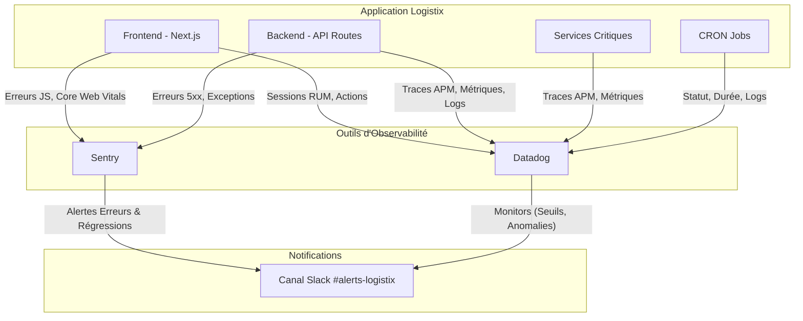

# Plan d'Intégration de l'Observabilité (Sentry & Datadog)

## Introduction

### Contexte

Ce document présente le plan stratégique pour l'intégration des outils d'observabilité Sentry et Datadog au sein de l'application Logistix. L'objectif est de garantir une supervision complète, une traçabilité des erreurs et une analyse proactive des performances du système, depuis l'interface utilisateur jusqu'aux services backend et tâches planifiées.

### Objectifs

- **Fiabilité** : Détecter, diagnostiquer et résoudre les erreurs en temps réel.
- **Performance** : Monitorer les temps de réponse, identifier les goulots d'étranglement et optimiser les ressources.
- **Traçabilité** : Suivre le parcours d'une requête à travers les différents services (APM).
- **Proactivité** : Mettre en place des alertes pour anticiper les incidents avant qu'ils n'impactent les utilisateurs.

### Outils retenus

- **Sentry** : Spécialisé dans la capture et l'analyse des erreurs applicatives (frontend et backend).
- **Datadog** : Plateforme unifiée pour le monitoring des métriques, des logs, et l'APM (Application Performance Monitoring).

## Points d'Instrumentation

### Frontend (Next.js / React)

- **Sentry** :
  - **Initialisation** : Configurer le SDK Sentry dans `app/layout.tsx` pour capturer automatiquement les erreurs non gérées et les rejets de promesses.
  - **Capture manuelle** : Utiliser `Sentry.captureException(error)` dans les blocs `catch` des composants critiques (ex: formulaires, appels API).
  - **Performance** : Activer le suivi des performances pour mesurer les Core Web Vitals et les temps de chargement des pages.
  - **Contexte utilisateur** : Associer les erreurs à l'utilisateur authentifié (`Sentry.setUser`) pour faciliter le débogage.

- **Datadog (RUM - Real User Monitoring)** :
  - **Initialisation** : Intégrer le SDK Datadog RUM pour collecter les sessions utilisateur, les vues de page et les actions.
  - **Actions personnalisées** : Suivre des actions utilisateur spécifiques (ex: `datadogRum.addAction('click_sync_button')`) pour analyser les parcours.

### Backend (API Routes Next.js)

- **Sentry** :
  - **Wrapper d'API** : Envelopper les gestionnaires de routes API avec `withSentry` pour capturer automatiquement les erreurs serveur (5xx).
  - **Capture manuelle** : Utiliser `Sentry.captureException` pour les erreurs métier spécifiques (ex: validation de données, échec de logique).

- **Datadog (APM & Métriques)** :
  - **Tracing distribué** : Configurer l'APM Datadog pour tracer les requêtes entrantes, les appels aux services internes et les requêtes de base de données.
  - **Métriques personnalisées** :
    - `api.requests.count` : Nombre de requêtes par endpoint.
    - `api.requests.latency` : Latence par endpoint.
    - `api.auth.errors` : Nombre d'échecs d'authentification.

### Services Critiques (`lib/services/`)

- **Datadog (APM)** :
  - **Instrumentation des fonctions** : Utiliser des décorateurs ou des wrappers (`@datadog/tracer`) pour créer des spans APM autour des fonctions critiques :
    - `auth.ts` : `verifyCredentials`, `createSession`.
    - `sync-service.ts` : `syncAllMetadata`, `makeAuthenticatedRequest`.
    - `db.ts` : Fonctions d'accès à la base de données.
  - **Tags de service** : Appliquer des tags pour segmenter les traces par service (ex: `service:auth`, `service:sync`).

### Tâches Planifiées (CRON Jobs - `scripts/cron/`)

- **Datadog** :
  - **Monitoring de job** : Utiliser l'API Datadog pour envoyer des métriques de début, de fin (succès/échec) et de durée pour chaque job.
    - `cron.job.duration` : Durée d'exécution du job.
    - `cron.job.status` : 1 pour succès, 0 pour échec.
  - **Logs** : Envoyer les logs des jobs vers Datadog pour une analyse centralisée.

## Conventions de Logging et Gestion d'Erreurs

### Format des Logs

Tous les logs applicatifs devront suivre un format **JSON structuré** pour faciliter le parsing et l'analyse dans Datadog.

```json
{
  "timestamp": "2023-10-27T10:00:00.000Z",
  "level": "info",
  "message": "User authenticated successfully",
  "context": {
    "service": "auth-service",
    "environment": "production",
    "version": "1.2.0",
    "user": {
      "id": "c4a760a8-dbcf-4e43-9d29-333b3f5d5a6a"
    },
    "trace_id": "xyz-123",
    "span_id": "abc-456"
  }
}
```

### Niveaux de Sévérité

- **DEBUG** : Informations de débogage détaillées (désactivé en production).
- **INFO** : Événements normaux et significatifs (ex: démarrage d'un service, authentification réussie).
- **WARN** : Situations inattendues mais non bloquantes (ex: tentative de renouvellement de token échouée, API externe lente).
- **ERROR** : Erreurs qui empêchent une fonctionnalité de s'exécuter correctement (ex: échec d'une requête base de données, exception non gérée).
- **CRITICAL** : Erreurs critiques qui menacent la stabilité du système (ex: perte de connexion à la base de données).

### Gestion des Erreurs

- **Centralisation** : Mettre en place un gestionnaire d'erreurs global (middleware) dans l'API pour standardiser les réponses d'erreur et garantir que toutes les exceptions sont capturées.
- **Enrichissement** : Avant d'envoyer une erreur à Sentry, l'enrichir avec le maximum de contexte possible (ID utilisateur, `trace_id`, `payload` de la requête).
- **Ne pas exposer les détails** : Les réponses d'erreur HTTP ne doivent jamais exposer de détails d'implémentation ou de messages d'erreur bruts. Retourner un message générique et un ID d'erreur (`correlationId`) que l'utilisateur peut communiquer au support.

## Bonnes Pratiques de Configuration et Maintenance

### Gestion des Secrets

- **Variables d'environnement** : Les clés d'API (Datadog) et DSN (Sentry) doivent être stockées dans des variables d'environnement (`SENTRY_DSN`, `DATADOG_API_KEY`) et ne jamais être commitées dans le code source.
- **Vault** : Pour les environnements de production, envisager l'utilisation d'un gestionnaire de secrets comme HashiCorp Vault ou AWS Secrets Manager.

### Sécurité et Conformité (RGPD)

- **Anonymisation (PII)** : Configurer Sentry et Datadog pour nettoyer automatiquement les données personnelles identifiables (PII) des logs et des rapports d'erreur.
  - **Sentry** : Utiliser l'option `beforeSend` pour retirer les champs sensibles (ex: `email`, `password`, `token`).
  - **Datadog** : Mettre en place des règles de nettoyage (Scrubbing Rules) au niveau de la collecte des logs.
- **Contrôle d'accès** : Appliquer le principe du moindre privilège pour l'accès aux dashboards Sentry et Datadog.

### Alerting

- **Alertes Sentry** :
  - **Nouvelles erreurs** : Configurer des alertes pour être notifié immédiatement lorsqu'une nouvelle erreur (non vue auparavant) est détectée.
  - **Régression** : Créer des alertes lorsque des erreurs marquées comme "résolues" réapparaissent.
- **Monitors Datadog** :
  - **Seuils** : Définir des moniteurs basés sur des seuils (ex: latence API > 500ms, taux d'erreur > 5%).
  - **Anomalies** : Utiliser la détection d'anomalies pour être alerté des comportements inhabituels.
  - **Intégration Slack** : Envoyer toutes les alertes critiques sur un canal Slack dédié (`#alerts-logistix`).

### Maintenance

- **Revue des dashboards** : Organiser une revue mensuelle des dashboards pour s'assurer qu'ils restent pertinents et utiles.
- **Gestion des quotas** : Surveiller la consommation des quotas (événements Sentry, logs Datadog) pour éviter les dépassements.
- **Mise à jour des SDKs** : Planifier une mise à jour trimestrielle des SDKs Sentry et Datadog pour bénéficier des dernières fonctionnalités et correctifs de sécurité.

## Exemples d'Intégration (Conceptuels)

*Note : Ces exemples sont fournis à titre indicatif et ne constituent pas une implémentation finale.*

### Sentry : Initialisation et Nettoyage des Données (Frontend)

```typescript
// Fichier: sentry.client.config.ts
import * as Sentry from "@sentry/nextjs";

Sentry.init({
  dsn: process.env.NEXT_PUBLIC_SENTRY_DSN,
  tracesSampleRate: 1.0,
  
  // Nettoyage des données avant envoi
  beforeSend(event, hint) {
    // Retirer les informations de l'utilisateur si présentes
    if (event.user) {
      delete event.user.email;
      delete event.user.ip_address;
    }
    // Retirer les données potentiellement sensibles des "breadcrumbs"
    if (event.breadcrumbs) {
      event.breadcrumbs = event.breadcrumbs.filter(
        (breadcrumb) => breadcrumb.category !== 'xhr'
      );
    }
    return event;
  },
});
```

### Datadog : Wrapper pour Tracing APM (Backend)

```typescript
// Fichier: lib/utils/tracing.ts
import tracer from 'dd-trace';

type AnyAsyncFunction<T> = (...args: any[]) => Promise<T>;

export function withTrace<T>(
  spanName: string,
  fn: AnyAsyncFunction<T>
): AnyAsyncFunction<T> {
  return async (...args: any[]) => {
    const span = tracer.startSpan(spanName);
    try {
      // Ajoute des tags pour le contexte
      span.setTag('service', 'my-app-service');
      
      const result = await fn(...args);
      span.setTag('otel.status_code', 'OK');
      return result;
    } catch (error) {
      span.setTag('error', true);
      span.setTag('error.message', (error as Error).message);
      span.setTag('otel.status_code', 'ERROR');
      throw error;
    } finally {
      span.finish();
    }
  };
}

// Utilisation
// import { withTrace } from '@/lib/utils/tracing';
// const tracedSync = withTrace('sync.allMetadata', syncAllMetadata);
// await tracedSync(userId, token);
```

## Architecture d'Observabilité

Le diagramme ci-dessous illustre comment les différents composants de l'application interagissent avec Sentry et Datadog.



## Conclusion et Recommandations

L'implémentation de ce plan d'intégration pour Sentry et Datadog fournira une visibilité sans précédent sur la santé et les performances de l'application Logistix. En adoptant une approche structurée de l'instrumentation, du logging et de l'alerting, les équipes de développement et d'exploitation seront en mesure de collaborer plus efficacement pour garantir une expérience utilisateur de haute qualité.

### Recommandations

- **Déploiement progressif** : Commencer par l'environnement de pré-production pour valider la configuration et l'impact sur les performances avant de déployer en production.
- **Formation des équipes** : Organiser une session de formation pour présenter les dashboards, les conventions de logging et les procédures d'alerte.
- **Itération continue** : L'observabilité n'est pas un projet ponctuel. Les dashboards, les alertes et les métriques devront être revus et adaptés en continu pour répondre à l'évolution de l'application.
