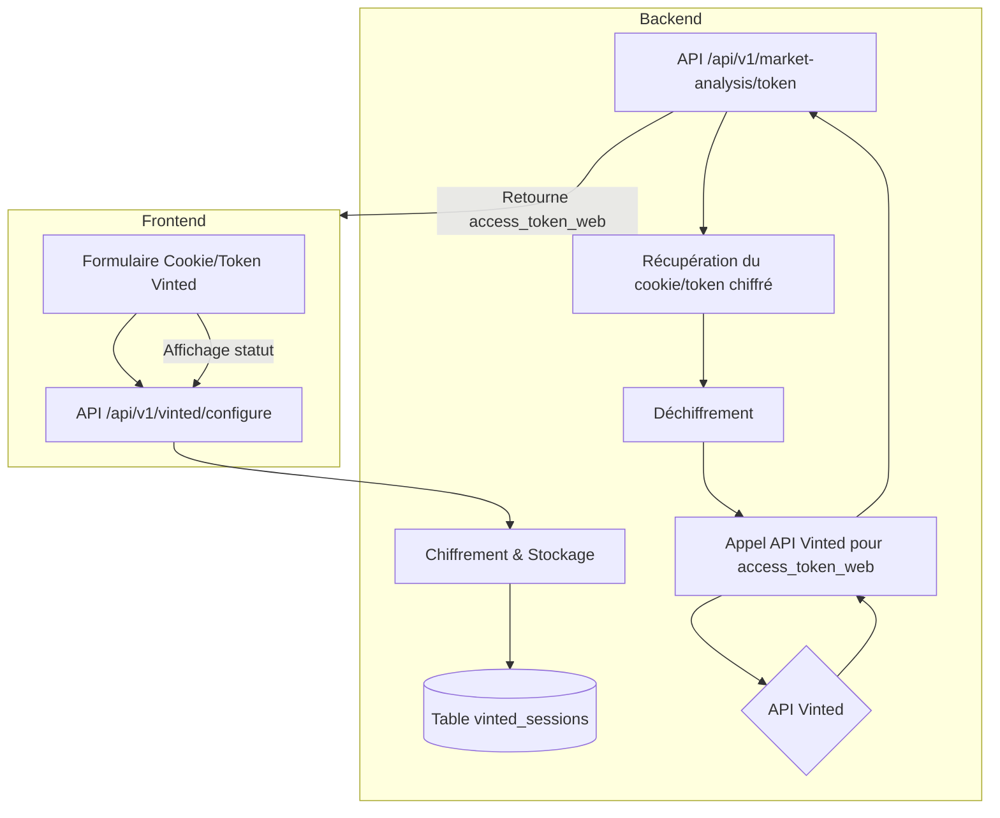

# Spécification Technique : Authentification Vinted par Cookie/Token Manuel

Ce document décrit l’architecture et la logique de gestion du cookie/token Vinted pour l’accès aux APIs, sans automatisation du login.

## 1. Architecture et Flux

L’utilisateur fournit manuellement un cookie ou token Vinted (_vinted_fr_session ou access_token_web) via l’interface. Ce secret est chiffré côté serveur et utilisé pour obtenir un access_token_web valide à chaque appel API.

### 1.1. Diagramme d’architecture



## 2. Modèle de Données

### 2.1. Table `vinted_sessions`

```sql
CREATE TABLE vinted_sessions (
    id UUID PRIMARY KEY,
    user_id UUID NOT NULL UNIQUE,
    vinted_session_token_encrypted TEXT NOT NULL,
    session_expires_at TEXT,
    status VARCHAR(20) NOT NULL DEFAULT 'requires_configuration',
    last_validated_at TEXT,
    last_refreshed_at TEXT,
    refresh_error_message TEXT,
    created_at TEXT NOT NULL,
    updated_at TEXT NOT NULL
);
```

- **vinted_session_token_encrypted** : Cookie/token Vinted chiffré (AES-256-GCM).
- **status** : 'active', 'expired', 'error', 'requires_configuration'.
- **last_refreshed_at** : Dernier rafraîchissement réussi.
- **refresh_error_message** : Dernière erreur rencontrée.

## 3. Flux d’authentification

1. L’utilisateur copie-colle son cookie/token Vinted dans le formulaire.
2. Le backend chiffre et stocke ce secret dans la table `vinted_sessions`.
3. Lors d’un appel API nécessitant Vinted, le backend :
   - Déchiffre le cookie/token.
   - Appelle l’API Vinted pour obtenir un access_token_web.
   - Utilise ce token pour les appels API.
4. Si le token est expiré ou invalide, l’utilisateur doit fournir un nouveau cookie/token.

## 4. Sécurité

- Le cookie/token est chiffré en base (AES-256-GCM).
- La clé de chiffrement est stockée dans une variable d’environnement sécurisée.
- Aucun identifiant ou mot de passe Vinted n’est stocké.
- L’utilisateur est informé que son cookie/token est utilisé uniquement pour accéder à l’API Vinted.

## 5. Points importants

- Plus d’automatisation du login : l’utilisateur doit fournir manuellement le cookie/token.
- Plus de Puppeteer, plus de stockage d’identifiants, plus de table vintedTokens.
- Le flux OAuth Vinted n’est plus utilisé.
- La suppression de la configuration supprime le cookie/token chiffré.
